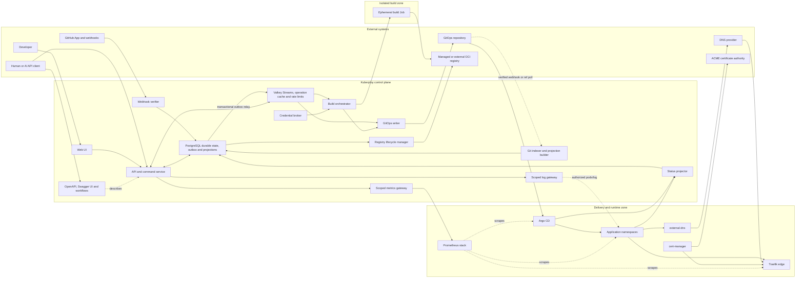
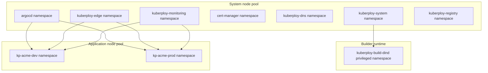
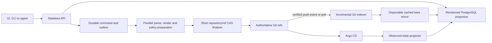
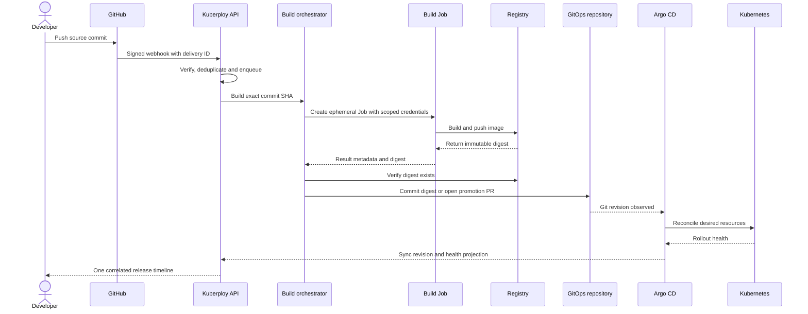
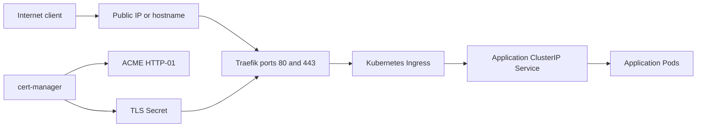
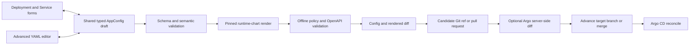
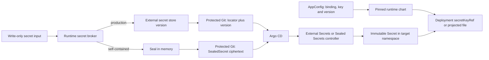
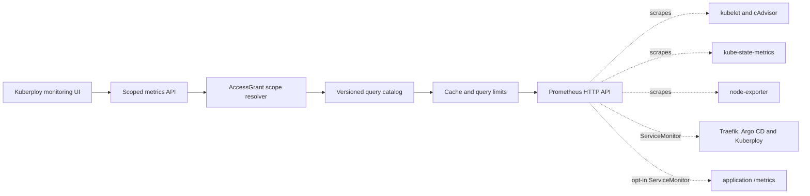
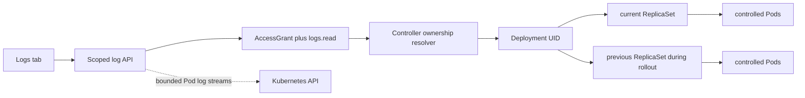

# Kuberploy Architecture

Status: proposed architecture for the first production-capable release.

## 1. Product definition

Kuberploy is a self-hosted, Kubernetes-native PaaS with a Dokploy-like developer experience and a strict GitOps deployment model.

The platform supports four App source modes:

1. GitHub App: build an installed GitHub repository on Kubernetes, push the resulting OCI image, commit its immutable digest to Git, and let Argo CD deploy it; verified webhooks can trigger builds.
2. Git SSH: clone any supported Git provider with a generated App- or Project-scoped deploy key, then run the same build pipeline through manual or API triggers.
3. OCI image: resolve an existing registry image to an immutable digest, commit it to Git, and let Argo CD deploy it.
4. Helm chart: pass a chart source from OCI, a Helm repository, or Git plus one values document directly to Argo CD.

Kuberploy also installs or adopts Traefik so an application can be exposed by entering a domain and port in the UI. cert-manager supplies automatic TLS, and an optional managed external-dns integration can create DNS records per route.

### Product promise

> Managed OCI and source-built App configuration is Git-authoritative, Helm App revisions are durable control-plane records, and Argo CD is the only normal application deployment writer.

## 2. Architectural decisions

| Decision | Choice |
|---|---|
| Desired-state authority | Git for managed OCI/source Apps; durable Helm revision records projected directly to Argo CD for Helm Apps |
| Control-plane read path | Revisioned PostgreSQL projections derived from Git; no Git/provider call per UI or API read |
| Git write scaling | Parallel preparation with only short compare-and-swap finalization per repository/ref, plus configurable repository/ref shards |
| Deployment engine | Argo CD |
| Ordinary app packaging | Versioned, platform-owned `kuberploy-runtime` Helm chart |
| Advanced app packaging | External Helm/OCI chart with policy restrictions |
| Managed runtime authoring | Guided forms plus bounded Deployment, Service, Ingress and ServiceAccount YAML overrides over one canonical `AppConfig` draft |
| Runtime settings | Ordinary values render to versioned immutable ConfigMaps; sensitive values use write-only, versioned secret bindings |
| Runtime secret backends | Strict namespace/name-bound Sealed Secrets first; External Secrets remains unavailable until an audited concrete remote material writer exists |
| Source builds | Privileged DinD with BuildKit/buildx; runs on one schedulable node by default, with optional dedicated-node isolation |
| Build orchestration | Ephemeral Kubernetes Jobs created by the build controller |
| Application image registry | Managed in-cluster or external OCI registry; the managed mode uses one logical repository per service and persistent storage |
| Image retention | Keep the latest configurable `N` successful release digests per service, plus every digest still selected, running, pinned or in-flight; reclaim all other managed artifacts after a safety window |
| Public ingress | Managed Traefik by default; existing ingress controller supported |
| Automatic TLS | cert-manager with ACME HTTP-01 initially |
| Public API contract | OpenAPI 3.2.0 interoperability profile, self-hosted Swagger UI and machine-readable Arazzo workflows |
| Durable operational database | PostgreSQL for operations, idempotency, transactional outbox, audit and revisioned projections |
| Fast delivery and ephemeral state | Valkey from P0 for Streams consumer groups, one bounded operation-status read-through cache and distributed rate limits |
| Dependency versions | Newest mutually compatible stable releases at each Kuberploy release cut, then exact version and digest locks; floating `latest` references are forbidden |
| MVP process model | Modular monolith deployed as API and worker Deployments |
| Release identity | Source commit + image digest/chart revision + GitOps commit |
| Rollback | New Git commit selecting a previous immutable release whose artifact is still retained |

## 3. Core invariants

1. Git is authoritative for non-secret desired deployment state.
2. Argo CD is the only normal path that creates or updates application workloads.
3. Builders create images only. They never deploy workloads and never receive GitOps write credentials.
4. PostgreSQL stores users, workflow state, integrations, audit events, rebuildable projections, and explicitly stopped Environment-clone drafts. A stopped clone draft cannot create workload or Git state; Git becomes authoritative only when the user explicitly starts it.
5. Kubernetes and Argo CD are authoritative for observed runtime state.
6. Kuberploy-managed plaintext secret values never enter Git, Git commit messages, build logs, traces, caches, asynchronous queues, or ordinary database columns. Caller-supplied build arguments remain caller-owned immutable build-definition input and may be retained by the definition, Docker history, or caches; they are not echoed in result projections, and secret-like names produce a non-blocking warning. Base64 is encoding, not protection.
7. Mutable image tags may be user input, but Kuberploy resolves and deploys an immutable digest.
8. A successful build is not a successful deployment. The UI displays each stage separately.
9. Privileged DinD is treated as a node-level trust boundary even though it does not mount the host Docker socket.
10. Form mode and YAML mode are two editors for the same versioned Git object. Neither creates hidden overrides or bypasses rendering, policy or Argo CD.
11. The browser UI, CLI, SDKs and AI agents use the same versioned public API. No undocumented UI-only or administrator mutation may bypass its authorization, validation, audit, Git or Argo CD path.
12. Git is the desired-state authority, not the request-time query engine, work queue or observed-state database. Every cached/projected copy of desired or observed state is revision-tagged, rebuildable and never presented as newer than its indexed/observed source revision.
13. Workloads receive configuration through explicit same-namespace `configMapKeyRef`, `secretKeyRef` or read-only projected files. Secret values are never rendered as literal Deployment environment values or injected into every sidecar implicitly.
14. Valkey accelerates delivery and reads but is never the sole durable record of an accepted command, audit event, idempotency result or desired/observed state. PostgreSQL outbox replay can reconstruct every required Stream message after Valkey loss.
15. A Kuberploy release is reproducible from its committed dependency lock. "Latest" is resolved during a reviewed update, never dynamically during installation or reconciliation.
16. Managed-registry cleanup is mark-and-sweep and fails closed. It never deletes a digest selected by current Git intent, observed in a running rollout, pinned for recovery, referenced by an active Operation, inside the service's retained rollback window, or younger than the configured safety age.

## 4. System architecture



### Logical control-plane components

These are code boundaries, not necessarily separate microservices in the MVP.

| Component | Responsibilities | Explicitly does not do |
|---|---|---|
| Web UI | Product forms, Git diff preview, App delivery timeline, logs and health through a generated public-API client | Hold Kubernetes or Git credentials or call private mutation endpoints |
| API and command service | Authentication, RBAC, contract-conformant validation, idempotency and async operation creation | Apply application manifests directly |
| API contract publisher | Serve bundled OpenAPI documents, interactive Swagger UI, agent profile, workflow descriptions and human guides from the running release | Maintain a second hand-written API model or weaken runtime authorization |
| Webhook receiver | HMAC validation, delivery deduplication and fast enqueue | Perform a build synchronously |
| Valkey transport and cache | Deliver PostgreSQL-outbox work through bounded Streams consumer groups; hold the revision-keyed pending/running Operation detail cache and distributed rate-limit counters | Become desired-state authority, hold the only copy of accepted work, retain raw logs or secret material, or decide authorization from cached data alone |
| Git indexer and projection builder | Consume verified push events, incrementally fetch changed refs, parse changed paths and atomically advance revisioned PostgreSQL read models | Treat a projection row as authority or mutate desired state |
| GitOps writer | Prepare changes from cached Git objects, revalidate, advance refs with compare-and-swap and commit or open a PR | Serve ordinary UI reads, build images or modify live workloads |
| Build orchestrator | Queue builds, mint scoped credentials, create Jobs, collect result digests and retry workflow steps | Receive the GitOps write token inside a build Pod |
| Credential broker | Mint short-lived GitHub and registry credentials from stored references | Expose root credentials to the UI or builders |
| Registry lifecycle manager | Install the managed registry, connect external registries, and for managed mode only calculate protected digests, preview retention, delete eligible manifests and trigger safe blob garbage collection | Treat tags as release identity, delete any external-registry artifact, or override a live/Git/Operation protection reference to meet a storage target |
| Runtime secret broker | Accept write-only secret input, synchronously write it to an approved external store or seal it in memory, and return only opaque version metadata or ciphertext to the durable workflow | Reveal an existing value, serialize plaintext into PostgreSQL/outbox/logs/traces, or let Argo render-time plugins decrypt it |
| Status projector | Watch Argo Applications and Kubernetes resources and cache observed state | Write observed state back to Git |
| Edge manager | Install/adopt Traefik, cert-manager and external-dns; report the public endpoint and manage routing/DNS defaults | Act as a second deployment engine |
| Monitoring manager | Install/adopt `kube-prometheus-stack`, render approved monitors/rules and report target health | Invent a second source of desired configuration outside Git |
| Scoped metrics gateway | Authorize a requested scope, expand a named query template and proxy bounded Prometheus API queries | Expose Prometheus or arbitrary tenant PromQL directly |
| Scoped log gateway | Resolve authorized Deployment/Pod ownership, read bounded `pods/log` streams and multiplex them for the UI | Expose Kubernetes credentials, accept arbitrary namespaces or grant exec/attach access |

For the MVP, ship one codebase as:

- `kuberploy-api`: stateless API, UI and webhook ingress.
- `kuberploy-worker`: queue consumer, Git indexer, projection builder, GitOps writer, build orchestrator and status projector.
- PostgreSQL: command idempotency, transactional outbox, build records, audit log and revisioned projections.
- Valkey: required P0 acceleration layer for Streams dispatch, the bounded Operation detail cache and distributed limits; all correctness-critical content is recoverable from PostgreSQL or an external authority.
- Managed OCI registry or an external registry integration: durable image bytes for source builds. Kuberploy owns storage, retention and garbage collection only in managed mode; external lifecycle is operator-owned.

This keeps a self-hosted installation small while preserving boundaries that can later be scaled independently.

## 5. Kubernetes topology



Recommended namespaces:

- `kuberploy-system`: API, worker, credential references, Valkey or its connection secret, and PostgreSQL or its connection secret.
- `argocd`: Argo CD components.
- `kuberploy-edge`: managed Traefik.
- `cert-manager`: cert-manager.
- `kuberploy-dns`: one managed external-dns Deployment per configured DNS integration.
- `kuberploy-monitoring`: managed Prometheus Operator, Prometheus, Alertmanager, kube-state-metrics and node-exporter resources.
- `kuberploy-registry`: optional managed OCI registry, authentication/token service if required by the selected implementation, lifecycle Job/controller and persistent storage. It is absent when an external registry is adopted.
- `kuberploy-build-dind`: privileged DinD Jobs. Only the build controller can create workloads here.
- `kp-<project>-<environment>`: ordinary application workloads with restricted Pod Security, quotas and default-deny networking.

The starter configuration schedules privileged DinD on the installation's current schedulable node so all build features work on one VM. This means a compromised source build can compromise that node. Helm's `builder.nodeIsolation.enabled` value supplies only the revision-zero install default. After bootstrap, platform administrators manage node isolation, maximum concurrent builders, and checkout/DinD/agent requests and limits through **Settings → Source builders**. Kuberploy stores immutable settings revisions in PostgreSQL. Queue concurrency changes apply to pending work; scheduling and resources are copied into each new immutable build attempt. Operators running mutually untrusted source should enable node isolation, provision the exact builder label/taint, and keep control-plane and production workloads off those nodes. A separate installation remains the strongest isolation boundary.

## 6. Data authority and domain model

### Authority by data type

| Data | Authority |
|---|---|
| Managed App configuration, selected release, routes and resources | GitOps repository |
| Helm App source coordinates and values | Immutable PostgreSQL Helm revision history projected to Argo CD |
| Application monitoring intent in `runtime.monitoring` | The application's environment GitOps repository |
| Monitoring stack settings, ingestion profiles, monitor-generation policy, recording rules and alert rules | Protected platform GitOps repository |
| Generated application monitor-target manifests | Rebuildable protected Git materialization derived from the source application commit plus platform policy; never manually editable |
| Source commit | Source Git provider |
| Image bytes, manifests and digest | Managed or external OCI registry |
| Registry mode and repository ownership; managed-registry retention policy | Protected platform/application Git configuration |
| Artifact lifecycle state, protection reasons, deletion attempts and observed registry usage | PostgreSQL; rebuilt and revalidated against Git plus the registry before every destructive action |
| Chart package and revision | Helm/OCI repository |
| Live sync, health, Pod state and edge address | Argo CD and Kubernetes |
| Metric samples, rule evaluation and active alert state | Prometheus and Alertmanager; Kuberploy stores no competing time-series copy |
| Pending/running Operation detail cache | Valkey, keyed by effective principal grant revision plus exact Operation/publication revision; every value is disposable and rebuildable |
| Worker delivery signals and rate-limit windows | Valkey; PostgreSQL operations/outbox remain the repair sources |
| Live and recent container logs | Kubernetes Pod `log` subresource and kubelet-managed node log files |
| Retained searchable logs, when enabled later | Configured Loki-compatible backend; Kuberploy remains the authorization gateway |
| Non-secret runtime values and their inheritance | GitOps repository; rendered ConfigMaps are derived materializations |
| Secret binding, selected version and authorized delivery metadata | Protected GitOps repository; PostgreSQL holds only a rebuildable redacted projection |
| Plaintext secret values in production mode | Configured external secret store; namespace-local Kubernetes Secrets are derived materializations |
| Self-contained secret payload | Namespace/name-bound SealedSecret ciphertext in Git; the controller key and derived namespace-local Kubernetes Secret remain in the cluster |
| Users, memberships, API service accounts, hashed token metadata, provider installation IDs and credential references | PostgreSQL |
| Builds, operations, webhook deliveries and audit records | PostgreSQL |
| Stopped App configuration copied by Environment clone | PostgreSQL until an explicit Start App publishes it to Git; no workload, Git command or provider action exists before that start |
| UI/API config, list, search and status read models | Rebuildable PostgreSQL projections containing Git-derived documents/fields and observed-state fields, each annotated with its indexed/observed revision |

### Core entities

| Entity | Purpose |
|---|---|
| Organization | RBAC, quota and audit boundary |
| AccessGrant | Assigns a role to a user, group or API service account at platform, organization, Argo project, environment or namespace scope |
| APIServiceAccount | Named automation principal with an owner, scoped grants and independently expiring/revocable token records; unrelated to a Kubernetes workload ServiceAccount |
| Project | Groups applications and environments |
| Environment | Binds a project to one administrator-approved namespace, Git path and the project's Argo AppProject; a project gains multiple namespaces by owning multiple environments |
| Application | Stable logical workload independent of an environment, with one durable source kind: `oci`, `github`, `git-ssh`, or `helm` |
| DeploymentSpec | Configuration of an application in one environment; a cloned stopped draft is local and editable until explicit Start App publication makes Git authoritative |
| VariableSet | Git-backed project or environment ordinary values and opt-in secret-binding references; application-level values remain in `AppConfig` |
| BuildDefinition | Source repository, ref rules, context, Dockerfile and builder settings |
| Build | One immutable build attempt and its execution state |
| Release | Source SHA, build config hash, image digest or chart revision and provenance |
| Promotion | Selection of an existing Release for an environment |
| GitBinding | Repository, branch, base path and credential reference |
| Registry | Managed/external mode, OCI endpoints, owned repository prefix, storage policy and credential references |
| RegistryArtifact | Observed repository, immutable manifest/index digest, size, platforms, owning service, Release relationship, protection reasons and lifecycle state; never the authority for image bytes |
| ArtifactRetentionPolicy | Managed-registry platform default plus bounded per-service override for retained successful releases, unreferenced grace age and administrator pins; not applied to external registries |
| DNSIntegration | DNS provider, allowed zones/domains, credential reference, ownership ID and reconciliation policy |
| Domain | Hostname, path, target port, TLS policy and manual/automatic DNS policy |
| RouteKeyReservation | Candidate lease and post-push `CommittedPendingIndex` guard for one normalized hostname/listener/path key across Git shards; rebuildable coordination only, never desired-state authority |
| CertificateBinding | Scoped reference to a custom TLS certificate or cert-manager issuer plus non-secret expiry/SAN metadata |
| SecretStoreIntegration | Platform-admin-owned external-store or Sealed Secrets configuration, health, allowed organization paths and destination namespaces; provider credentials are not fields on this object |
| SecretBinding | Scoped logical secret name and allowed keys, store reference, delivery policy and authorized target namespaces; it contains no readable secret values |
| SecretVersion | Immutable opaque version identity plus creation/rotation metadata and materialization status; the value is never returned or stored in ordinary PostgreSQL |
| MiddlewareProfile | Reusable, scoped Traefik middleware configuration that is materialized into application namespaces |
| MonitoringIntegration | Managed, existing or disabled Prometheus mode plus Git-stored retention, storage, scrape and feature settings; credentials remain secret references |
| MetricsIngestionProfile | Platform-admin policy for allowed application metric families/labels and body, sample and active-series budgets |
| Operation | Asynchronous user-visible command state |
| GitProjectionCheckpoint | Provider-verified target head, last fully indexed repository/ref commit, event identity, scan generation, lag and error state |
| GitDocumentProjection | Rebuildable raw/parsed document and content hash keyed by repository, ref, path and source blob |
| DeploymentObservation | Cached Argo sync/health and Kubernetes rollout state |
| AuditEvent | Actor, action, before/after Git revisions and result |

Application identity is separate from release identity. The same digest is promoted from development to staging and production without rebuilding.

### PostgreSQL maintenance contract

The schema is organized by lifecycle, not by UI screen. Core product rows
(`users`, `teams`, `projects`, `environments`, `applications`) own current
identity and simple one-to-one settings. Durable commands, leases, outbox rows,
immutable revisions, provider receipts and rebuildable projections remain
separate because they have independent retention, retry, concurrency or audit
semantics. They must not be folded into mutable product rows merely to reduce
the table count.

One-to-one settings without an independent lifecycle belong on their owner.
For example, an App's durable source kind, registry-pull mode, and optional
project credential are columns on `applications`, not separate selection
tables. The source kind is chosen when the App identity is created and keeps
reloads and direct links on the same delivery workflow. The per-App source
build generation is also an atomic `applications.build_generation` counter;
it is not a separate one-row counter table. Workers increment that owner row
with `UPDATE ... RETURNING`, which preserves concurrent monotonic allocation
without another schema lifecycle. A source-build attempt is itself the durable
queue item, so workers lease `build_attempts` directly; there is no duplicate
source-build outbox table. Fresh-install bootstrap state is derived from the
absence of users under one PostgreSQL transaction-scoped advisory lock; it
does not need a permanent singleton table.

The permanent single-cluster contract likewise has no `cluster_id` column:
one singleton platform Git binding owns the fixed `platform/` protected root,
while environment bindings retain their
`tenants/<project>/environments/<environment>` roots. Adding a table or
restoring an installation/cluster identifier requires a new durable lifecycle
that cannot be represented safely by an existing owner, command, revision,
receipt or projection.

## 7. GitOps repository contract

Use separate repositories or separately protected trust boundaries.

```text
kuberploy-platform.git
  platform/
    projects/
    applicationsets/
    namespaces/
    policies/
    edge/
    secrets/
      stores/              # non-secret store policy and scope metadata
      bindings/            # logical keys and opaque version metadata
      materializations/    # ExternalSecret references or SealedSecret ciphertext
    monitoring/
      stack.yaml
      profiles/
      rules/
      targets/

kuberploy-environments.git
  tenants/
    acme/
      variables.yaml         # project defaults; ordinary values and authorized references only
      environments/
        dev/
          variables.yaml     # environment overrides; ordinary values and authorized references only
          apps/
            payments/
              app.yaml       # sole editable input for a managed runtime app
            reporting-chart/
              app.yaml       # external chart identity and platform policy metadata
              values.yaml    # sole external-chart values document
        production/
          apps/
            payments/
              app.yaml
```

The platform repository is admin-controlled. It contains Argo `AppProject`, `ApplicationSet`, namespace, quota, admission-policy, edge, monitoring-stack, recording-rule and generated monitor-target resources.

The environment repository contains app-level intent plus project/environment `VariableSet` inputs. One protected `ApplicationSet` per project/environment discovers its app paths while fixing the Argo project, destination cluster and destination namespace. Tenant-controlled fields must never template an unrestricted Argo project or cluster destination. An application's config dependency set includes exact presence or absence plus the blob identity of each inherited VariableSet, so its preview token and path-scoped ETag become stale if a parent value changes concurrently.

An application's validated `runtime.monitoring` block in the environment repository is authoritative application intent, but a tenant-controlled Application never renders Prometheus Operator CRDs. An idempotent trusted materializer writes the corresponding target under a protected platform/generated-target repository and annotates it with source repository, ref, path and application `configRevision`. Before every create/update/delete, it requires the source binding to be fully indexed through its provider-verified `targetHeadRevision` and confirms that the application's current `configRevision` equals the job revision. If the target head is ahead of indexing, it defers; if a newer app revision is current, the job becomes `Superseded`. It also uses CAS against the target's recorded source revision, so an older job cannot recreate a target after a newer disable. That generated file is a rebuildable projection, not a second manually editable authority; platform policy remains authoritative for what may be generated. A cross-repository failure becomes `MonitoringConfigPending` and retries without rolling back the already-authoritative application commit.

For a managed runtime application, `app.yaml` is the only editable application-scoped desired-state document. The compiler maps it plus the two optional inherited VariableSets in memory to the pinned runtime chart; it never commits a second editable application `values.yaml` representation. Argo passes the exact project, environment, and application paths in that precedence order. Missing parents are empty scopes. Because Argo's missing-value-file switch also applies to `app.yaml`, three operator-owned expected-identity parameters force the chart to reject a missing or substituted application document. For an external Helm application, `app.yaml` owns chart identity/revision and platform policy metadata while one `values.yaml` owns chart values; their field sets do not overlap.

Caller-controlled Argo `parameters`, `valuesObject`, `.argocd-source.yaml` and UI parameter overrides are forbidden for Kuberploy-managed Applications because their precedence can silently create desired state outside the canonical Git files. The sole parameter exception is the server-generated project/environment/application identity fence described above; it carries no editable workload value.

An `app.yaml` is a versioned Kuberploy file schema, not a second Kubernetes deployment controller:

```yaml
apiVersion: config.kuberploy.io/v1alpha1
kind: AppConfig
metadata:
  name: payments
spec:
  delivery:
    mode: build
    source:
      provider: github
      repository: acme/payments
      branch: main
      context: .
      dockerfile: Dockerfile
    release:
      sourceRevision: 8a31d4f
      repository: registry.example.com/acme/payments
      digest: sha256:abc123
  runtime:
    replicas: 2
    env:
      - name: LOG_LEVEL
        value: info
      - name: DATABASE_URL
        valueFrom:
          secretBindingRef:
            name: payments-database
            key: url
            version: "7"
    ports:
      - name: http
        containerPort: 3000
      - name: metrics
        containerPort: 9090
    resources:
      requests:
        cpu: 100m
        memory: 128Mi
    monitoring:
      enabled: true
      port: metrics
      path: /metrics
      interval: 30s
  routes:
    - host: payments.example.com
      path: /
      port: http
      dns:
        mode: externalDns
        integrationRef: cloudflare-primary
      tls:
        mode: letsencrypt
        issuerRef: kuberploy-letsencrypt-production
        redirectHttp: true
```

For managed OCI and source-built Apps, the ApplicationSet renders a pinned `kuberploy-runtime` chart from `app.yaml`. Helm Apps use a separate direct Argo CD path: Kuberploy stores the source coordinates and raw values as an immutable revision, then projects one deterministic `Application`. Argo resolves and renders the chart. The installer-owned Helm AppProject and admission policy remain the enforcement boundary.

### Git write protocol

1. `GET config` returns a `ConfigBundle` from the indexed projection plus one opaque, strong quoted `ETag` bound to its repository/ref identity, document blobs and declared dependency blobs, not to unrelated paths on the branch. The response also exposes informational target-head and indexed commits so lag is explicit.
2. `POST config/preview` requires that `If-Match` and accepts either replacement YAML for named bundle documents or typed JSON Patch operations targeting the exact parsed JSON document returned for each name.
3. The API validates schema, permissions, domain uniqueness and source policy, then the GitOps writer renders the proposed tree and returns semantic, Git and redacted resource diffs plus a short-lived preview token.
4. `PUT config` repeats the exact candidate or patch with `If-Match`, `Preview-Token` and `Idempotency-Key`; the server rechecks the candidate hash, actor, schema, chart and policy versions.
5. Development may receive a direct bot commit. Protected environments receive a pull request.
6. Before entering the ref lane, the preparer incrementally fetches the remote head. Inside the lane, the finalizer performs only a bounded remote-ref OID check, final key/dependency checks, commit creation and a timed normal fast-forward push. If the OID moved and objects or rendering must be refreshed, it releases the lane, fetches/re-prepares and then retries. If only unrelated paths changed, the identical semantic change can be replayed and revalidated; if any bundle/dependency blob or rendered effect changed, it returns a path-level conflict and requires a new preview. Kuberploy never force-pushes.
7. The operation succeeds when the commit or pull request is created. Argo sync and Deployment rollout health remain later observed phases on the deployment-status resource.

Manual Git changes are supported. The indexer rebuilds the UI projection from Git and shows exact target-head, indexed, config, candidate and observed revisions so stale data is visible.

### Git authority without a synchronous Git bottleneck

Git authority does not mean cloning, fetching or parsing a repository during every API request. Kuberploy separates the desired-state log, the read model and the observed runtime:



PostgreSQL is a materialized view of Git, not a competing desired-state store. A queued command, preview or pending pull request is workflow state only. It becomes desired state when its commit reaches the configured authoritative target ref; the projection advances only after indexing that commit.

#### Read path and revision semantics

| Revision field | Exact meaning |
|---|---|
| `targetHeadRevision` | Provider-verified tip of the authoritative configured target ref; this is desired state even when indexing is behind |
| `indexedRevision` | Target-head commit completely materialized into the active PostgreSQL projection generation |
| `configRevision` | Most recent target-ref commit that changed this specific ConfigBundle/read set |
| `candidateRevision` | Preview or pull-request ref commit; never desired state until the target ref advances to include it |
| `observedRevision` | Revision Argo CD reports for the Application, independent of projection freshness |

- MVP application lists, configuration documents, search, route summaries and deployment timelines are served directly from their bounded PostgreSQL projections. The first release uses Valkey read-through caching only for hot pending/running Operation detail polling. Before every cache lookup PostgreSQL re-evaluates authorization and returns the current principal grant revision, Operation generation/update revision and joined pull-request publication revision. Cache loss, corruption, expiry or write rejection therefore causes an ordinary PostgreSQL read.
- A projected document stores repository ID, ref, path, source commit, Git blob ID/content hash, raw YAML, parsed fields, schema/parser version and `indexedAt`. Raw YAML in PostgreSQL is a rebuildable copy used for fast editing, never the authority.
- Every desired-state response reports the relevant revision fields, projection age/staleness and pending operation IDs. The UI must distinguish `Git committed, indexing pending` from both `not committed` and `deployed`; it never labels a candidate pull-request revision as desired.
- A config ETag is the hash of `GitBinding` ID, target ref, sorted document path/blob IDs, sorted declared dependency path/blob or tree IDs, schema version, chart digest and policy version. Unrelated commits on a shared branch therefore do not cause false edit conflicts. Uniqueness dependencies are key-scoped: a route change binds only its normalized `(hostname, listener/protocol, path-overlap key)` and exact current owner blob, not one global domain-index revision.
- Read-your-write is explicit: the write Operation exposes `gitRevision` and `projectionStatus`. A client polls until that revision is indexed before expecting a subsequent read model to include it. A GET may request `atLeastRevision`; it waits only for a bounded projection interval and otherwise returns a typed `ProjectionNotReady` problem plus `Retry-After`. The API never hides a synchronous provider fetch behind an ordinary GET.
- Authorization is evaluated before projected rows or cached documents are returned. Cache keys or list caches never turn an unauthorized object into an existence oracle.

#### Valkey P0 contract

Valkey is required from the first release, but it is an acceleration and delivery layer rather than a new authority:

1. The API first commits the `Operation`, idempotency record and transactional outbox row in PostgreSQL. It never acknowledges an accepted durable command based only on a successful Valkey write.
2. A relay fairly selects eligible outbox work and appends only an opaque `operationId`, work kind, tenant/scope ID, generation and trace ID to a bounded Valkey Stream. The full command payload remains in PostgreSQL; plaintext secrets, credentials, raw YAML, rendered manifests and logs never enter Valkey work messages.
3. Worker pools use dedicated consumer groups for build, Git/index, Git-write and reconciliation work. A worker reads with `XREADGROUP`, loads and revalidates the current PostgreSQL Operation, performs an idempotent step, durably records the result, and only then acknowledges with `XACK`. Abandoned pending entries are reclaimed after a lease timeout. Synchronous validation/preview keeps its bounded non-durable worker path and never serializes an unvalidated editor body into Valkey.
4. A repair loop republishes any eligible nonterminal PostgreSQL Operation that has no valid worker lease/progress, including after a Valkey reset. Delivery is therefore at-least-once and duplicates are expected; deterministic operation/resource keys and generation checks provide correctness.
5. MVP clients recover and advance status solely by polling the authorized Operation/status GET endpoints. The first release deliberately does not advertise or publish a cross-replica Pub/Sub/SSE wake path; that optimization remains deferred until an authenticated bounded status stream consumes it end to end.

Valkey also stores distributed rate-limit counters. Its sole MVP response cache is the short-TTL pending/running Operation detail cache: every entry includes its exact source revision and authorization-scope hash, and authorization is re-evaluated in PostgreSQL before lookup. Failed or completed Operation bodies, worker/problem detail strings, arbitrary request IDs, secret values, Sealed Secret ciphertext, provider credentials, bearer tokens, raw manifests and raw log lines are forbidden in Valkey.

Every key uses a purpose and schema-version prefix, an explicit TTL or bounded Stream-retention rule, and a documented maximum encoded size. Operation-cache keys include the effective principal grant revision hash, Operation ID/generation, exact row/publication revision and schema version. A wrong-version, malformed, wrong-revision or wrong-scope entry is discarded and recomputed. The 64 KiB envelope has a 30-second production TTL (hard maximum two minutes), and only metadata-only queued/running bodies with server-generated request IDs and no detail/problem/pull-request payload are eligible. Unvalidated editor bodies and unredacted manifests never enter Valkey.

If the distributed limiter is unavailable, token issuance, secret writes and other credential/high-risk endpoints fail closed with `503` and `Retry-After`. Ordinary authenticated reads use a conservative process-local fallback and PostgreSQL; ingress-level limits remain a separate outer boundary.

The bundled P0 profile uses a memory limit, `noeviction`, explicit Stream length/age trimming and TTLs plus application-enforced cache budgets, so cache growth cannot silently evict work signals or security counters. Cache-write rejection degrades to PostgreSQL/backend reads; Stream-write rejection leaves work safely pending in the PostgreSQL outbox and activates backpressure. Optional AOF persistence and a PVC shorten recovery but are not counted as the durable command guarantee, and Valkey backups are not required for correctness. The API's Kubernetes readiness probe does not depend on Valkey: it reports `Degraded` through health/status while fallbacks remain available instead of causing a cache outage to evict every API Pod.

The installer requires `valkey.mode=managed|external`; there is no `none`. The small managed profile uses the pinned official Valkey Helm chart in standalone mode because all content is recoverable. Production may select its replication or operator-managed cluster profile, or a compatible managed Valkey endpoint that passes the capability test; Valkey Cluster is not required for P0. A later scale profile may split transport/rate-limit and cache workloads into separate Valkey deployments.

The Go control plane uses the pinned `github.com/valkey-io/valkey-go` client behind an internal interface. Installation preflight verifies the exact commands Kuberploy relies on—`XADD`, `XGROUP`, `XREADGROUP`, `XACK`, pending-entry reclaim, cache get/set/expiry and ACL/TLS behavior—rather than accepting an endpoint merely because it speaks a superficially compatible protocol.

Valkey is ClusterIP-only with default-deny NetworkPolicy and distinct ACL users for API cache/rate-limit access, outbox publishing and worker consumer groups. It is never exposed through Traefik. External Valkey connections require authenticated TLS; credentials are supplied through the platform secret backend and never written to Git.

#### Incremental indexing and reconciliation

1. An HMAC-verified Git push webhook is durably deduplicated by exact GitHub App, installation, repository, ref and delivery/after-commit identity, acknowledged quickly and queued for indexing. It bumps a monotonic wake generation only for bindings matching that exact tuple. The advertised commit is retained for audit and replay collapse but is never accepted as the target head or passed to the indexer as authority; Kuberploy always verifies the actual remote ref.
2. The indexer incrementally fetches the exact configured ref into a local mirror and compares it with `GitProjectionCheckpoint`.
3. For an ordinary fast-forward, it computes the changed paths between checkpoint and new commit and parses only mapped Kuberploy paths. A delta below configured path/byte/row thresholds writes affected rows plus the checkpoint in one transaction. A larger valid delta builds the next projection generation in bounded chunks and atomically swaps it only when complete, avoiding one unbounded transaction, lock interval or WAL burst.
4. A force-push, missing ancestor, parser-version change or suspected projection corruption marks the binding `Diverged`, pauses its automatic mutations and triggers a full branch scan into a new projection generation. A short transaction swaps the generation only after the scan succeeds, so readers see either the complete old or complete new view. A deleted ref becomes `MissingRef` and retains the explicitly stale old projection until an administrator restores or rebinds it. Policy then decides whether queued operations are still safe to replay.
5. Verified webhooks provide the fast path. A jittered remote-ref poll repairs missed webhooks and manual provider configuration errors; repeated failures back off and never create a tight provider API loop.
6. Only the authoritative target ref advances desired-state projections. Pull-request and preview refs remain candidate state linked to their Operations until normal merge moves the target ref.

Webhook delivery and indexing are at-least-once. Reprocessing the same repository/ref/commit is a no-op. A manual `Refresh` command can prioritize one binding, but it enters the same bounded queue rather than cloning inside the API process.

Invalid manually committed application content is indexed as authoritative-but-invalid data, not treated as an indexer crash. The projection stores its raw blob, syntax/schema/policy diagnostics and invalid status, advances the repository checkpoint when path mapping remains safe and blocks automatic writes to that affected bundle until corrected. This prevents one bad YAML file from freezing visibility for every other application on the ref.

#### Write scheduler and concurrency

Git permits only one successful next value for a given ref, so the design minimizes rather than denies that serialization point:

1. The API records the idempotent command and outbox event in PostgreSQL, then returns an Operation.
2. The outbox relay appends the opaque Operation routing envelope to the appropriate Valkey Stream. Workers consume concurrently, load the exact PostgreSQL command and prepare from the exact indexed base using cached Git objects. YAML parsing, semantic patching, Helm rendering, OpenAPI validation, policy checks and diff generation run in parallel across operations.
3. Preparation records the read set, write set, dependency blob hashes and candidate document hashes. It does not hold a repository-wide lock.
4. Preparation fetches every required object before final ref advancement enters a short lane keyed by `(repositoryId, targetRef)`. A lease/fencing record reduces duplicate local work, but correctness comes from a bounded remote-OID comparison and timed normal fast-forward push, not from trusting a Valkey or database lock. Slow fetch, chart download, render or full policy work never runs while the lane is held.
5. If the remote head moved, the worker releases the lane. A disjoint read/write set is fetched, replayed onto the new head and dependency-sensitive validation is rerun before reacquiring it. An overlapping document, touched uniqueness key/current-owner blob, policy input or changed rendered effect returns a semantic conflict rather than silently choosing an order.
6. The commit contains Operation/audit trailers. If the push succeeds but the worker dies before updating PostgreSQL or acknowledging Valkey, retry locates that commit and completes the existing Operation instead of creating another commit.

Parse/render/policy results may be cached content-addressably by candidate document hashes, chart digest, Kubernetes capability set, schema and policy version. Finalization always reruns head-dependent authorization, touched route/other key-scoped uniqueness and changed-dependency checks; a render cache is never allowed to decide branch safety.

The synchronous `200` preview contract means the client waits for a bounded result, not that the API executes Helm/chart work on request handlers. Validation and preview dispatch to a separate per-tenant-fair worker pool with strict queue, wall-time, CPU/memory, chart/package-size, rendered-resource-count and output-byte limits. Renderers receive pinned local inputs and no ambient credentials or unrestricted network. Saturation returns `429` or `503` with `Retry-After`; preview work never acquires a Git ref lane. Content-addressed hits may bypass rendering but still rerun authorization and current dependency checks.

The projection maintains a revisioned route-ownership index keyed by normalized hostname/listener/path semantics. Preview records only keys the candidate adds, removes or changes. Finalization checks those keys against the latest-head delta and their current owner blobs in bounded time; two unrelated hostnames do not conflict or require an O(repository size) scan inside the ref lane.

For API writes on different repository/ref shards, a PostgreSQL `RouteKeyReservation` keyed by the same normalized tuple prevents two Kuberploy Operations from concurrently claiming one route. Before push it is an expiring candidate lease. After a successful push, the idempotent finalizer transitions it to `CommittedPendingIndex` with the winning binding/ref/commit; that guard has no normal lease expiry and blocks new claims until the commit is indexed into route ownership. Git and PostgreSQL cannot update atomically, so an expiring candidate lease is released only after a repair check proves the Operation commit is absent; if the commit exists, repair reconstructs the committed guard. If the relevant binding projection is stale, new claims fail closed. Only indexing or a repair worker that authoritatively verifies provider ref/history may release or reconstruct the guard. This remains rebuildable coordination, not desired-state authority. Manual Git changes still pass repository CI and admission uniqueness policy; an out-of-band conflict marks the affected bindings invalid instead of making the reservation table a hidden source of truth.

The PostgreSQL outbox relay/scheduler may use `FOR UPDATE SKIP LOCKED` for parallel fair selection; execution workers use Valkey Streams consumer groups and acknowledge only after durable PostgreSQL progress. Commands on different refs finalize concurrently; commands on one ref serialize only for fetch/recheck/commit/push. Protected-environment candidate branches and pull requests can also be prepared in parallel, while the provider's protected merge or merge queue remains the authority for advancing the target branch.

Push auto-deploy is an explicit, immutable policy rather than an effect of every
webhook. In the Source Builds UI, a human selects one exact build definition,
environment deployment snapshot and project service-account identity, and can
enable, disable or repin the policy while retaining its immutable history. Each
revision pins the source deployment generation, AppConfig ETag,
image-independent canonical intent, and
ordered project/environment VariableSet provenance. Only a successful verified
build-release projection enqueues a durable run for the enabled current policy
revision. The controller reauthorizes the enabled service account with exact
project/environment/application `app.edit` scope on every attempt, without
creating or storing a bearer token.

The controller changes only the verified immutable image and then re-enters the
canonical deployment path, which freshly resolves scheduling and middleware
profiles, secret references, private pulls, edge/`sslip.io`/TLS policy, and the
environment's direct-or-pull-request Git publication plus Argo readiness. A
human AppConfig or parent VariableSet change pauses the policy until a human
saves a new immutable revision; a prior image-only auto-deploy does not count as
drift. Runs, attempts, retry/failure state and accepted Operation/deployment
receipts are durable and idempotent. Epoch-fenced leases are heartbeated during
submission, and a lease-loss retry converges through the deterministic command
key rather than duplicating a deployment. The feature and its mutation surfaces
fail closed unless a fresh controller lease matches the exact source-build,
Git-projection, foundation and protected-Argo runtime identities;
`/v1/capabilities` reports `autoDeploy: false` while that proof is unavailable.

#### Repository partitioning and local Git cache

- P0 uses one low-churn protected platform repository plus one or more environment `GitBinding` shards. Every DeploymentSpec maps to exactly one writable GitBinding/ref/path; Kuberploy never dual-writes two desired-state locations. Small installations may use one environment repository; organizations or trust boundaries can receive separate repository/ref shards without changing the AppConfig model. A repository per application is avoided because it transfers the bottleneck into repository management and Argo repo-server overhead.
- The scheduling/serialization unit is a repository/ref, while the conflict unit is the declared path/dependency set. Sustained queue wait, repository size, Git-provider throttling, Argo manifest-generation time and webhook fan-out are measured before adding shards.
- Shard assignment is stored explicitly in `GitBinding`. Rebalancing is an audited migration that freezes the affected environment, copies and verifies the target commit, changes Argo references and resumes writes; it is never an implicit hash change that moves authority unexpectedly.
- High-churn trusted generated resources, such as monitoring targets, may move from the low-churn platform-config repository into protected generated-target shards. Each generated object records the source application commit so retries and repair remain deterministic.
- Each writer shard keeps a disposable bare mirror and creates a unique detached temporary worktree for a command, sharing immutable Git objects instead of recloning full history. One shard owns a mirror at a time; another worker may discard and rebuild it after failover.
- Credentials are injected only for fetch/push and are not embedded in mirror remotes. Worktrees are removed after the Operation, stale worktrees are pruned and cache garbage collection runs under bounded maintenance concurrency.
- GitOps repositories contain compact configuration plus small protected policy/materialization manifests only. Source trees, image layers, build caches, chart archives, log files, bulk rendered workload output, submodules, Git LFS objects and large binaries are rejected. File count, individual document size and total reachable repository size have warnings and administrator limits.
- P0 uses full incremental fetches for predictable compatibility because the repositories are intentionally small. Partial clone/sparse features are optional later optimizations only after every configured Git provider and recovery path passes compatibility tests.

The mirror is a performance cache, not a shared authority. Kuberploy never exposes it over the network, and Argo CD maintains its own repository cache independently.

#### Argo CD reconciliation load

- The Git provider sends verified push webhooks to the Kuberploy indexer; polling remains a repair path. After a provider-verified platform desired-state commit, Kuberploy requests one admission-fenced metadata refresh of the installer-owned root Application so Argo re-reads the branch immediately.
- Each generated Argo Application uses a fully qualified target ref, points at the narrow application directory and carries `argocd.argoproj.io/manifest-generate-paths` for its true dependencies, preventing an unrelated monorepo path from forcing unnecessary manifest generation.
- New/deleted application directories refresh the owning ApplicationSet; an ordinary edit refreshes the existing Application without regenerating every project.
- Kuberploy pushes once and lets Argo auto-sync. It never issues `app sync` and never refreshes each workload Application; only the single root Application receives the bounded refresh above. Its status projector consumes Argo/Kubernetes watches rather than polling Argo once per application.
- At higher scale, repo-server replicas, manifest-generation parallelism/cache storage, webhook refresh workers/jitter and application-controller processors are tuned from observed queue and reconciliation metrics for the current cluster.
- A bulk commit may deliberately contain several trusted generated targets, but operations retain individual audit links. Argo webhook jitter prevents a large change from creating a synchronized repo-server refresh spike.

#### Backpressure, fairness and performance objectives

The command scheduler uses per-organization fairness and bounded concurrency. Security repair/rollback and interactive changes outrank automatic webhook deployments; lower priority never starves. Provider-specific concurrency, retry budgets and `Retry-After` are honored. A failing binding enters `WaitingForGit` behind a per-binding circuit breaker and cannot occupy every worker needed by healthy repositories. When queue or disk limits are reached, the API retains already accepted commands but rejects new optional automation with `429` or `503` plus `Retry-After` rather than exhausting memory or spawning unbounded clones/builds.

Initial design objectives at supported MVP load are:

- at least 99% of normal API reads make no Git-provider, Argo or Kubernetes request;
- p95 projected list/detail reads below 200 ms inside the cluster;
- p95 verified webhook durable acknowledgement below 1 second;
- p95 verified push-webhook-to-indexed projection below 5 seconds when the provider is healthy;
- p95 interactive command queue-to-Git-finalization below 10 seconds, excluding human pull-request wait and provider outage;
- p95 Git-commit-to-Argo-observation below 30 seconds with repository webhooks healthy;
- missed webhook convergence within two configured fallback poll intervals;
- 100% of desired-state responses carry revision and freshness metadata;
- no noisy organization can consume every Git finalizer or build worker slot.

Track projection lag, oldest index/write/preview queue age, preview saturation/cache hit/render-limit failures, fetch/push latency, bytes and objects fetched, mirror hit/rebuild rate, prepare/finalize duration, safe rebase/conflict rate, provider throttling, repository size, Argo webhook-to-observation time and repo-server manifest-generation latency. Breaching a target first triggers backpressure/tuning; sustained repository/ref queueing is the signal to add a shard.

## 8. Build subsystem

### Builder contract

All build engines accept an immutable input and produce an immutable output.

Input:

- source repository and exact commit SHA;
- build-definition revision and hash;
- context and Dockerfile path;
- target architecture and stage;
- caller-supplied build arguments and managed secret references; secret-like
  argument names produce a non-blocking warning, while managed secret values
  are never persisted by Kuberploy;
- target registry repository;
- resource, timeout and egress profile.

Output:

- OCI image digest;
- friendly tags, if any;
- build logs and duration;
- cache metadata;
- optional SBOM, provenance and signature references;
- terminal status and failure reason.

Builder modes:

| Mode | Use | Isolation |
|---|---|---|
| `buildkit-rootless` | Preferred Dockerfile builder | One rootless BuildKit daemon per Job; capability preflight required |
| `dind` | Docker compatibility mode | One privileged Docker daemon per Job on isolated nodes |
| `image` | Existing image | No build Job; resolve tag to digest and validate pull access |

### Managed registry and bounded retention

Source builds require one configured registry integration. An administrator can
select the bundled `managed` mode or adopt an `external` OCI registry. Managed
mode runs in `kuberploy-registry` with persistent storage and a stable TLS
hostname reachable by both build Jobs and Kubernetes nodes. The public API and
Git model remain provider-neutral. The first managed adapter uses the
release-locked OCI Distribution 3.1.1 image and Kuberploy-owned Kubernetes
templates; later adapters must satisfy the same lifecycle contract.

Existing-image deployments continue to use their source registry by default;
managed retention never assumes ownership of or deletes those artifacts. Copying
an external image into the managed registry is a separate explicit promotion
operation, not a hidden side effect of deployment.

An existing-image tag is previewed through a server-owned authorized registry
target and credential profile, but the server freshly resolves it again before
persistence. Git stores only the resulting immutable digest. When a caller
supplies the previewed expected digest and the tag moved before submission, the
request fails with `ImageTagMoved` instead of silently deploying different
bytes.

Repositories are partitioned by immutable project, application and service IDs.
P0 has one stable `main` service per application. Builders push a unique
human-friendly tag but return and deploy only the immutable OCI digest; tags do
not determine rollback eligibility.

Retention is configured by platform default with a bounded per-service override:

```yaml
registry:
  mode: managed
  retention:
    keepLastSuccessful: 10
    unreferencedGracePeriod: 24h
```

`keepLastSuccessful` counts distinct successfully deployed OCI release digests,
not tags or build attempts. Cleanup also protects current Git-selected digests
across every environment, digests observed in active rollouts, active Operation
inputs/outputs, manual pins and artifacts inside the grace period. Therefore `N`
is the normal rollback window, not a hard cap that can break an older production
environment. Failed, never-deployed and superseded artifacts are reclaimed after
the grace period. The window is ordered by the durable Release creation time and
ID, never by a mutable tag or provider upload timestamp; promoting the same
digest again does not consume another slot.

The registry lifecycle manager calculates an auditable dry-run mark set, then
revalidates Git projection freshness, target heads, Operations and registry
manifests immediately before deletion. Stale or unavailable authority skips
cleanup. Blob garbage collection runs only through registry-supported global
reachability so shared layers and multi-platform child manifests are not removed
while referenced. A storage hard limit rejects new builds rather than deleting a
protected image.

For managed mode, the UI shows repository usage, retained releases, each
protection reason, reclaimable bytes, last cleanup result and rollback
availability. Service owners can request a policy within administrator bounds;
only platform administrators change global limits, storage or pins. External
mode labels retention and garbage collection as `Operator managed` and exposes
no Kuberploy delete/cleanup action. Full managed-mode rules are recorded in
[`ADR 0005`](docs/adr/0005-managed-registry-retention.md).

### Registry-backed Buildx cache

Registry cache is enabled by default for source builds. The trusted build agent
first invokes the pinned Buildx/BuildKit toolchain in a cache-only phase with
the equivalent of:

```text
--cache-from=type=registry,ref=<cache-ref>
--cache-to=type=registry,ref=<candidate-cache-ref>,mode=max,image-manifest=true,oci-mediatypes=true
```

This is the same registry exporter/importer model used by
`docker/build-push-action`; Kuberploy invokes Buildx directly inside its build Job
instead of requiring a GitHub Actions runner. A second invocation has no cache
flags and pushes the final application image using a distinct release-push
Docker configuration. Both invocations reuse the same private BuildKit content
store, not registry credentials. The result is selected only by its immutable
digest.

The cache scope key contains the immutable organization/project/application/
service IDs, target platform set, builder engine and cache-schema versions,
build-definition hash, and a trust lane. It deliberately omits the source commit
so unchanged Dockerfile layers can be reused across commits. BuildKit's own
content checks decide whether a layer matches. Fork or untrusted pull-request
builds may read an approved base-branch cache but write only to an isolated lane;
they can never replace a protected-branch cache. There is no cross-tenant cache,
host `docker.sock`, `hostPath`, or shared `/var/lib/docker` volume.

Each export first uses a unique build-scoped cache reference. After a successful
export, the lifecycle manager advances the service/platform/trust-lane cache
alias under a short lease and records the resulting manifest digest. Concurrent
or interrupted exports can therefore leave only reclaimable candidate caches,
not corrupt release identity. A build may import a bounded set of the newest
verified cache manifests.

`mode=max` can contain intermediate filesystem layers and source-derived build
output, so cache repositories are private and use credentials distinct from
release push and runtime pull credentials. Kuberploy-managed Dockerfile secrets
use BuildKit secret/SSH mounts and are never supplied as build arguments or
copied into a layer. Caller-supplied build arguments are accepted for
compatibility, stored as part of the immutable build definition, flagged when
their names look sensitive, and may be retained by Docker history or cache;
cache export does not add any Kuberploy credential to the build.

Cache import and export are performance optimizations. A missing, expired or
unavailable cache produces a visible `ColdBuild`/`CacheDegraded` warning and the
build continues without cache. Build argument names that look like credentials
additionally produce a non-blocking `SensitiveBuildArg` warning; the argument
name and value are never copied into that warning. Failure to push the final
application manifest remains terminal. This matches `ignore-error=true`
behavior for cache export without hiding the warning from the build timeline.

In managed mode, cache lifecycle is separate from release retention. The
starting policy keeps two successful cache generations per
service/platform/trust lane, expires an unused generation after seven days, and
applies an administrator-configured byte quota. Active imports/exports receive
temporary protection. Under storage pressure, eligible cache candidates are
reclaimed before expired release artifacts; current and retained rollback
images are never sacrificed for cache. For an external registry, Kuberploy uses
the configured cache references but never deletes cache manifests or blobs; the
operator owns their TTL, quota, retention and garbage collection.

### Build and deploy sequence



### ARC-style DinD Job

DinD mode borrows the GitHub Actions Runner Controller topology without installing a runner:

```text
Build Job Pod
  checkout init container
    exact source SHA -> /workspace
  dind restartable init-sidecar
    privileged: true
    /var/run/docker.sock -> emptyDir
    /var/lib/docker -> emptyDir
  trusted build-agent container
    unprivileged Docker CLI/buildx
    /workspace mounted read-only
    DOCKER_HOST=unix:///var/run/docker.sock
  result volume
    digest and metadata
```

Requirements and controls:

- Kubernetes 1.29 or newer for the restartable init-sidecar pattern.
- No host Docker socket, `hostPath`, host PID, host network or host IPC.
- Pin builder images by version and digest.
- Read the current database-backed builder settings revision before creating an attempt. Never mutate a running Job when settings change.
- Enforce `maxConcurrentBuilders` while claiming queued attempts across worker replicas; continue reconciling preparing, running and cancelling attempts at capacity.
- `automountServiceAccountToken: false` and no Kubernetes RBAC for the build Pod.
- By default, worker readiness requires one Ready, uncordoned node without an untolerated hard taint; generated Jobs contain no node selector or toleration.
- When `builder.nodeIsolation.enabled=true`, readiness and admission require the exact `kuberploy.io/node-class=dind-builder` label and `kuberploy.io/dind-builder=true:NoSchedule` taint/toleration.
- Per-build `emptyDir` volumes with size limits and ephemeral-storage requests/limits.
- `activeDeadlineSeconds`, explicit attempt count and `ttlSecondsAfterFinished`.
- Docker daemon listens on the Unix socket only.
- The trusted agent controls the exact `docker buildx build --push` invocation. Repository-defined arbitrary host-side build scripts are not an MVP feature.
- Registry cache is scoped by immutable service/platform/trust-lane identity; no shared host directory or cross-tenant Docker data volume.
- Source-read, registry-push, GitOps-write and runtime-pull credentials are all separate.

The Docker CLI container being non-root does not make the Pod unprivileged. Control of the socket means control of the privileged DinD daemon. With default single-node scheduling, the installation accepts node compromise as an explicit availability/usability tradeoff; optional node isolation reduces the blast radius.

### Credential lifecycle

| Credential | Accessible by |
|---|---|
| GitHub App private key | Credential broker only |
| Short-lived installation token | Checkout init container only |
| Registry push credential | Trusted build agent, scoped to one image repository |
| Registry pull credential | Runtime namespace only |
| Managed-registry lifecycle/delete credential | Registry lifecycle manager only, scoped to the managed Kuberploy repository prefix; never created for an external registry or mounted into builders/workloads |
| Registry cache credential | Trusted build agent only, scoped to one service's cache repository and trust lane; runtime Pods cannot pull cache manifests |
| GitOps write credential | GitOps writer only |
| Argo Git credential | Argo repo server, read-only |
| Signing key | KMS or trusted signer, never the build Pod |

For a private runtime image, protected AppConfig contains only locked
`delivery.registryPull` target/profile/revision metadata. The runtime chart
derives the namespace-local immutable `imagePullSecret` name from the exact
target and profile revision; Kubernetes namespace scope keeps each copy local,
and callers never submit a Secret name
or credential reference. A worker reads one operator-projected, single-origin
Docker config, validates it before publishing readiness, and creates/adopts only
that exact `kubernetes.io/dockerconfigjson` Secret. Runtime-pull credentials
cannot be reused as builder push/cache credentials. Rotation creates a new
revisioned Secret; the old Secret is retained until desired Git, observed
workloads, and retained rollback releases all prove it is unreachable.

The checkout step removes credential-bearing Git configuration before the build begins. A build that successfully pushes an image but cannot update Git becomes `ArtifactReady / ConfigPending`; the Git step can be retried without rebuilding.

## 9. Delivery paths

### Build from Git

Webhook -> exact SHA -> build Job -> registry digest -> Git commit/PR -> Argo sync.

Repeated pushes may supersede older queued builds. A late older build can create a Release record, but compare-and-swap against the environment generation prevents it from automatically replacing a newer selected release.

### Existing image

The API authenticates to the registry, resolves a tag to its manifest digest, validates platform compatibility and pull access, then commits `repository@sha256:...`. A future “track tag” feature must create a new Git commit whenever the resolved digest changes.

### Helm chart

The App UI accepts one of three Argo CD source forms: OCI registry, classic
HTTPS Helm repository, or Git repository plus chart path. It also exposes one
raw `values.yaml` editor. Kuberploy validates and stores an immutable desired
revision, then creates or updates one deterministic Argo CD `Application`.
Argo CD owns provider access, chart resolution, rendering, synchronization,
health, and drift repair. Kuberploy does not download or repackage charts and
has no separate chart-approval or renderer-worker pipeline.

The generated `Application` is locked to the installer-owned
`kuberploy-helm-apps` AppProject and the App's server-derived Environment
namespace. That AppProject accepts external sources into `kp-*` namespaces and
arbitrary namespaced chart resources but denies cluster-scoped resources. It
exists independently of GitHub or a platform Git binding. Charts that
require CRDs, ClusterRoles, or other cluster-scoped installation are therefore
not tenant Helm Apps; platform operators install those foundations separately.

Private source credentials are ordinary operator-managed Argo CD repository
Secrets. Kuberploy never accepts repository passwords or keys in the Helm App
request. Values are stored as configuration, not secret storage; users must
reference platform-managed Secrets through chart-supported existing-Secret
settings instead of entering secret plaintext in `values.yaml`.

## 10. Built-in Traefik edge

Traefik is a managed platform add-on, not embedded into every application.



### Edge installation modes

| Mode | Behavior | Best for |
|---|---|---|
| `managed-loadbalancer` | Install the official Traefik chart with a `LoadBalancer` Service | Managed Kubernetes, MetalLB or k3s ServiceLB |
| `managed-hostport` | Install Traefik as an edge-node DaemonSet binding host ports 80/443 | Single-node or simple bare-metal installations |
| `existing` | Do not install Traefik; generate routes for a configured IngressClass | Clusters with an existing ingress controller |

Installer behavior:

1. Detect existing IngressClasses and a k3s-provided Traefik installation.
2. In `auto` mode, adopt a compatible existing Traefik or install managed Traefik.
3. Wait for the public Service address or show the selected edge-node addresses.
4. Store the chosen `ingressClassName` in the protected platform configuration.
5. Display DNS instructions in the UI.

The MVP uses standard `networking.k8s.io/v1` Ingress resources for broad compatibility. Gateway API `HTTPRoute`, TCP and UDP exposure can be added later without changing the user-level route model.

### Domain and TLS workflow

1. The user selects an application port and either enters `api.example.com` or selects the server-derived `sslip.io` convenience hostname.
2. Kuberploy checks that no other active route owns the same host/path.
3. The user selects manual DNS or an allowed external-dns integration. Manual mode shows the required A/AAAA/CNAME record; automatic mode will manage it.
4. An optional preflight verifies provider access and public DNS resolution.
5. The Git change records the host, path, port, DNS policy, selected TLS mode and ordered middleware references.
6. The runtime chart creates a ClusterIP Service and Ingress using the managed IngressClass.
7. For Let's Encrypt, cert-manager uses an ACME HTTP-01 solver for that IngressClass and writes the TLS Secret. For a custom certificate, the referenced TLS Secret is materialized into the application namespace. HTTP-only creates no TLS resources.
8. Traefik listens on the selected entrypoint, optionally terminates TLS, executes the ordered middleware chain and routes traffic to the Service.
9. The UI displays separate DNS, certificate and route health states.

Each route selects exactly one TLS mode:

| Mode | Generated behavior | Renewal owner |
|---|---|---|
| `httpOnly` | Serve through Traefik's port 80 entrypoint with no TLS Secret and no HTTPS redirect | None |
| `letsencrypt` | Create a cert-manager `Certificate` using an admin-approved Issuer/ClusterIssuer, then serve HTTPS and optionally redirect HTTP | cert-manager |
| `customCertificate` | Select an immutable scoped certificate version or upload a PEM certificate/private key; strict Sealed Secrets materializes a versioned `kubernetes.io/tls` Secret in the route namespace | User rotation through Kuberploy |

Recommended route schema:

```yaml
routes:
  - host: api.example.com
    path: /
    port: http
    dns:
      mode: externalDns
      integrationRef: cloudflare-primary
      ttl: 300
    tls:
      mode: letsencrypt
      issuerRef: kuberploy-letsencrypt-production
      redirectHttp: true
    middlewareRefs:
      - secure-headers
      - api-rate-limit
```

For custom TLS, `tls.secretRef` replaces `issuerRef` and is exactly
`{bindingId, name, version}`. It never contains a Kubernetes Secret name,
provider object name or credential reference. Kuberploy re-resolves the exact
organization/project/environment/application/namespace binding, derives the
versioned Secret name, checks that the public X.509 attestation covers the
route host, and requires a fresh continuous SealedSecret observation plus a
fresh matching observer-worker receipt before Git projection or Argo desired
state may advance. For HTTP-only, `tls.mode` is `httpOnly` and `redirectHttp`
is absent.

The certificate UI supports both selecting an existing scoped certificate and uploading a new certificate chain/private key. Upload processing must:

- parse PEM and reject malformed input;
- verify the private key matches the leaf certificate;
- display SANs, issuer, validity period and fingerprint;
- warn about hostname mismatch and approaching expiry;
- treat the private key as write-only and never return it after upload;
- send material only to the strict Sealed Secrets provider, never Git, ordinary PostgreSQL fields, a generic Kubernetes Secret API or an External Secrets profile;
- persist only the platform-keyed content identity, immutable provider artifact digests and public certificate metadata (SANs, validity and fingerprints);
- store only `{bindingId,name,version}` in Git and derive the namespace-local Secret name identically in policy and Helm;
- continuously observe the exact SealedSecret without reading the generated Secret or its data; deletion, drift, expiry, scope mismatch or a stale worker makes new desired state ineligible while existing traffic remains unchanged.

cert-manager is optional when every route uses HTTP-only or custom certificates. Let's Encrypt availability and the allowed production/staging issuers are configured by a platform administrator.

The installer accepts a base domain such as `apps.example.com`. With wildcard DNS pointing at Traefik, Kuberploy can assign `<app>-<environment>.apps.example.com` automatically. Per-host HTTP-01 certificates are the simple MVP. Wildcard certificate issuance requires DNS-01 provider integration and belongs in a later phase.

### Free `sslip.io` hostnames

`dns.mode: sslip` is the MVP convenience path for demos, test services and
low-traffic back-office tools whose owners do not want to bring a domain. The
caller supplies neither an IP address nor a hostname. Kuberploy observes the
configured Traefik `LoadBalancer` Service, derives the hostname on the server,
stores only the closed `sslip` intent in AppConfig, and revalidates the exact
observation before Git projection. The generated name includes a stable hash
of the application and environment plus the selected IPv4 address, so two
applications never accidentally share the same route.

Kubernetes may report each load-balancer ingress as an IP or as a hostname.
Kuberploy handles those cases conservatively:

- With direct public IPv4 addresses, canonical numeric sorting selects the
  first address. Array reordering therefore cannot change the hostname. The
  selected address is pinned in a fenced observation; if it disappears, the
  route becomes unavailable instead of silently moving to a different name.
- A hostname-only load balancer is not accepted by automatic mode because its
  DNS answers may rotate. An operator may instead configure
  `verified-static-ip` with one public IPv4 that the hostname must continuously
  resolve to. This supports an AWS NLB backed by a fixed address or EIP.
- A dynamic ALB hostname has no safe `sslip.io` mapping. It must use a real
  domain with CNAME/alias routing, normally through the external-dns path.
  Kuberploy cannot create a CNAME beneath `sslip.io` because it does not own
  that zone.

The API and UI never return the raw observed IP; they return the derived
hostname, source kind and observation time. Private, loopback, link-local,
carrier-grade NAT, documentation, benchmark, multicast, reserved and IPv6
addresses are rejected. `sslip.io` is a third-party convenience service with
no Kuberploy availability guarantee. HTTP-only is suitable for temporary use;
an approved cert-manager issuer may request an individual certificate for the
generated hostname, subject to public ACME and `sslip.io` availability and rate
limits. It is not a production-domain or wildcard-certificate substitute.

### external-dns integration

external-dns is optional globally and selectable per route. The route's DNS setting is explicit:

| Mode | Behavior |
|---|---|
| `manual` | external-dns ignores the Ingress. The UI displays the exact record and continuously reports whether it resolves to the Traefik edge. |
| `sslip` | Kuberploy derives a free hostname from a freshly observed and pinned public Traefik IPv4 address. No external-dns annotations are emitted. |
| `externalDns` | Kuberploy marks the Ingress for one allowed DNS integration. external-dns creates or updates the record and records ownership. |

The platform configures each external-dns Deployment with a label filter such as `kuberploy.io/dns-integration=cloudflare-primary`. The runtime chart adds that label only when `dns.mode` is `externalDns`. A manual Ingress has no matching label, so external-dns will not process the hostname that appears in `Ingress.spec.rules`.

For every automatic route, the runtime chart also sets explicit external-dns metadata:

```yaml
metadata:
  labels:
    kuberploy.io/dns-integration: cloudflare-primary
  annotations:
    external-dns.alpha.kubernetes.io/hostname: api.example.com
    external-dns.alpha.kubernetes.io/ttl: "300"
```

In LoadBalancer mode, external-dns can derive the target from Ingress status. In host-port mode, Kuberploy supplies the configured public edge IP or hostname as an explicit target.

#### DNS integrations configuration page

Only platform administrators create or change DNS integrations. The settings page provides:

- integration name and enabled/dry-run state;
- provider selection and provider health/status;
- workload identity or write-only credential reference;
- allowed domain suffixes and optional zone IDs;
- unique TXT owner ID and TXT prefix/suffix;
- reconciliation policy: `upsert-only` by default, with `sync` as an explicit advanced choice;
- default TTL and permitted TTL range;
- optional provider-specific settings such as Cloudflare proxy mode;
- “test credentials and zones” plus a rendered deployment diff before save;
- assignment of the integration to allowed organizations, projects and environments;
- last successful reconciliation, current errors and managed-record count.

Non-secret integration settings and credential references live in the protected platform Git repository. Provider secrets live in the secret store. Argo CD reconciles one external-dns Deployment per integration in `kuberploy-dns` so each provider/zone boundary has independent credentials, filters, health and ownership.

Each external-dns instance uses:

- the Ingress source only for the MVP;
- a mandatory integration-specific label filter;
- mandatory domain and/or zone filters;
- TXT registry ownership with a unique owner ID;
- `upsert-only` policy by default to avoid deleting records unexpectedly;
- least-privilege provider credentials restricted to the configured zones.

Project administrators choose which pre-authorized integration is the default for their environment. Developers with route-write access can toggle automatic DNS per route and select from integrations allowed in that scope; they cannot add credentials or expand domain filters.

With `sync` policy, deletion is permitted only for records owned by that external-dns instance's TXT registry identity. The UI previews the deletion and requires confirmation when removing the last route that owns a hostname. With `upsert-only`, the UI reports the remaining record and offers an administrator-controlled cleanup action.

For Let's Encrypt HTTP-01, DNS and certificate reconciliation run independently. The UI shows `DNS Pending` until the record resolves, then cert-manager can complete the ACME challenge; a DNS failure is never presented as a TLS success.

### Traefik middleware management

Managed Traefik installs the Traefik CRDs and enables the Kubernetes CRD provider. Kuberploy stores middleware intent in Git, renders namespaced `traefik.io/v1alpha1` `Middleware` resources, and attaches the ordered list to the generated Ingress. Argo CD applies the change and Traefik hot-reloads it.

Middleware scope can be project, environment or application. A reusable project/environment profile is copied into each target namespace with a deterministic name; cross-namespace middleware references stay disabled.

The middleware UI provides:

- a reusable middleware library filtered by the user's AccessGrants;
- type-specific validated forms;
- an ordered, drag-and-drop chain on each route because middleware order changes behavior;
- generated YAML and Git diff preview before save;
- attach, detach, clone and delete-with-reference-check actions;
- application of the same optimistic Git revision checks as other config edits;
- Argo sync and route status after deployment.

P0 form editors:

| Category | Supported middleware |
|---|---|
| Redirect and paths | RedirectScheme, RedirectRegex, AddPrefix, StripPrefix, StripPrefixRegex, ReplacePath and ReplacePathRegex |
| Headers | Security headers, CORS and policy-allowed custom request/response headers |
| Traffic protection | RateLimit, InFlightReq and IPAllowList |
| Authentication | BasicAuth using a write-only secret reference |
| Request lifecycle | Compress, Buffering and Retry |
| Composition | Ordered middleware chains with cycle detection |

Expert mode is available to project administrators for supported Traefik HTTP `Middleware.spec` YAML. It is validated against the installed CRD schema and platform policy before Git commit. The following remain platform-admin-only or disabled:

- community/plugin middleware that executes code in the Traefik process;
- cross-namespace references;
- ForwardAuth endpoints that can reach cluster-private, link-local, metadata or control-plane addresses;
- PassTLSClientCert and sensitive credential/header forwarding;
- references to system middlewares, TLS options or services outside the granted project.

When Kuberploy adopts a non-Traefik ingress controller, the UI clearly disables Traefik-specific middleware editing for that edge target. Managed Traefik is the full-featured default.

### Edge security and availability

- Expose only ports 80 and 443 publicly. The Traefik dashboard is disabled or internal-only.
- Do not expose arbitrary Traefik annotations. Middleware changes go through the typed editor or policy-checked expert mode.
- Disable cross-namespace middleware and TLS-option references by default.
- Never fall back from failed HTTPS to HTTP automatically; the selected TLS mode is explicit.
- Use a mandatory external-dns label filter so manual routes cannot be processed accidentally.
- Enforce provider domain/zone filters before Git commit and again in the external-dns Deployment configuration.
- Give each external-dns instance a unique TXT owner ID; never share an owner ID across clusters or integrations.
- Runtime namespace NetworkPolicies allow `kuberploy-edge` to routed application ports and `kuberploy-monitoring` to an explicitly declared metrics port; no other cross-namespace ingress is implied.
- HTTP-01 solver Pods must remain reachable from Traefik when default-deny policies are enabled.
- Validate and normalize hostnames and paths; serialize domain claims to prevent conflicting routes.
- Use two Traefik replicas, a disruption budget and topology spread in LoadBalancer mode. Use one Pod per labeled edge node in host-port mode.
- Trust forwarded headers only from configured load-balancer or proxy ranges.
- Access logs and global defaults are platform-managed. Scoped rate limits, IP allowlists and security headers are available through the middleware manager.

## 11. Platform runtime chart

The versioned `kuberploy-runtime` Helm chart renders:

- Deployment for web or worker processes;
- ClusterIP Service;
- Ingress targeting the configured Traefik/existing IngressClass;
- external-dns integration label and hostname/TTL annotations only when automatic DNS is selected;
- cert-manager Certificate or custom TLS Secret reference according to the selected TLS mode;
- namespaced Traefik Middleware resources and ordered Ingress middleware annotations;
- ServiceAccount with no permissions by default;
- versioned immutable ConfigMaps plus versioned secret-binding references;
- startup, readiness and liveness probes;
- resource requests and limits;
- replicas and optional HPA;
- PodDisruptionBudget;
- rolling or recreate strategy;
- PVC mounts;
- restricted security-context defaults;
- topology spread and node-placement rules;
- a named metrics Service port and stable monitor metadata for an explicitly declared application metrics endpoint;
- rollout annotations containing the config revision.

### Guided form and Advanced YAML

Applications using `kuberploy-runtime` expose two editing tabs for Deployment and Service configuration:

| Mode | Purpose |
|---|---|
| `Form` | Guided controls, defaults, inline help and dependency-aware validation for common settings |
| `Advanced YAML` | Full versioned Kuberploy `AppConfig` runtime schema with completion, documentation, validation and diff |

A third `Rendered manifests` tab is read-only and shows the redacted Deployment, Service and related Kubernetes objects produced by the pinned chart. Editing happens only in Form or Advanced YAML.

These are not separate configuration modes. Both edit one revisioned draft parsed from the environment repository's `app.yaml`:



The shared draft uses the original Git blob plus one revision/ETag. The YAML editor submits raw text; form controls submit path-based semantic patches that the server applies to a comment-preserving YAML AST. Untouched comments, key order, scalar quoting and formatting are preserved; only edited nodes may be normalized. Schema-supported fields that have no form control are preserved and produce an `Advanced fields configured` badge with a link to their YAML location. A form save must never deserialize/rewrite the whole document or delete an advanced field silently.

The YAML parser rejects duplicate keys, multiple documents, custom tags, merge keys and anchors/aliases in P0. It enforces document-byte, depth, node-count and scalar-size limits. The exact Git diff is always shown before save. Invalid or ambiguous YAML remains an unsaved draft and cannot be converted to form state without fixing or explicitly discarding it.

The guided Deployment form covers:

- primary process command/arguments, container and named ports;
- replicas, update strategy, termination grace and optional HPA/PDB;
- CPU, memory and ephemeral-storage requests and limits;
- ordinary variables, existing secret bindings, write-only secret creation/rotation and explicit environment-variable or file delivery;
- startup, readiness and liveness probes;
- approved sidecars/init containers and volume mounts when enabled by policy;
- direct per-application node selection, affinity, anti-affinity, topology-spread and toleration controls.

### Resources and scheduling UI

Every managed service has a `Resources & Scheduling` section in both guided and
Advanced YAML modes. They edit the same Git-backed `AppConfig`; there is no
UI-only scheduling override.

The resource editor exposes per-container:

- CPU, memory and ephemeral-storage requests;
- CPU, memory and ephemeral-storage limits;
- effective LimitRange defaults, ResourceQuota headroom and validation that each
  request is positive and does not exceed its corresponding limit.

CPU and memory requests are explicit service values. Kubernetes scheduling and autoscaler provisioning use requests
to determine required capacity; limits govern runtime enforcement and do not
replace realistic requests. The UI warns about extreme request/limit ratios and
shows the estimated per-replica and total requested capacity before save.

A new service materializes these primary-container requests into AppConfig by
default:

```yaml
resources:
  requests:
    cpu: 50m
    memory: 100Mi
```

They are explicit Git-backed values, not hidden form defaults, so chart upgrades
cannot silently resize existing services. Resource limits remain separately
visible and editable and may be defaulted or required by cluster policy.

The scheduling editor exposes:

- `nodeSelector` keys and values, excluding Kuberploy and control-plane reserved keys;
- required and preferred node-affinity expressions;
- pod affinity and anti-affinity terms whose selector is exactly the current application;
- topology-spread constraints whose selector is exactly the current application;
- tolerations with key, operator, value, effect and optional seconds; and
- an optional Kubernetes PriorityClass name.

The service UI manages **tolerations**, not node taints. Permanent taints are
owned by cluster administrators or an autoscaler's NodePool. Kuberploy rejects
reserved control-plane and `kuberploy.io/*` toleration keys. Correctly declared
temporary Karpenter `startupTaints` do not require a
workload toleration and are not copied into AppConfig.

Scheduling is configured independently for each application. Pod relationship
and topology-spread selectors must contain only
`kuberploy.io/application=<current application UUID>`; cross-application IDs,
additional match labels and match expressions are rejected at every write and
projection boundary.

When Karpenter is detected, an optional read-only adapter observes
`karpenter.sh/v1` NodePools and NodeClaims. Before commit, Kuberploy intersects
hard Pod requirements with observed NodePool requirements and taints. A proven
empty intersection is rejected with exact field
diagnostics instead of creating a permanently pending Pod. Kuberploy renders
ordinary Kubernetes Pod scheduling fields—resource requests, selectors,
affinity, topology spread and tolerations—so the same AppConfig remains portable
to clusters without Karpenter.

A scale-to-zero NodePool needs no running node. Once Argo creates the Pod, the
Kubernetes scheduler marks it unschedulable against current capacity; Karpenter
can then provision from a compatible NodePool using those standard constraints.
Kuberploy never silently relaxes a hard rule to force scheduling. Preferred
rules are labeled as cost/availability hints because satisfying them can cause
additional nodes to be launched.

The status timeline distinguishes `WaitingForCapacity`,
`SchedulingConstraintUnsatisfied`, `QuotaExceeded`, `NodeProvisioning` (when a
Karpenter observation is available) and ordinary image/startup failures. It
shows relevant sanitized Pod events and configured scheduling fields, but never exposes
cloud credentials or allows service users to edit NodePools, NodeClasses, Nodes
or taints.

The guided Service form covers:

- Service and target port, name and TCP/UDP protocol;
- ordinary `ClusterIP` or an explicitly enabled headless Service;
- session affinity and internal traffic policy where supported;
- selection of the Service port used by a Traefik route or application metrics endpoint.

The guided path creates an ordinary internal Service and a separate Traefik
Route. A collapsed expert section provides separate partial YAML editors for
the generated Deployment, Service, Ingress and ServiceAccount. The renderer
merges Guided configuration first and the matching expert resource second, so
expert values win when both paths set the same ordinary Kubernetes field. This
supports provider annotations such as an EKS IAM role on the ServiceAccount or
Cloudflare proxy control on the Ingress without requiring a new form field.

The expert resource editors are not `extraObjects` or a cluster-wide manifest
escape hatch. They cannot change apiVersion, kind, name, namespace,
Kuberploy-owned labels/annotations, generated selectors, the primary immutable
App image, the App ServiceAccount identity, host isolation, HostPath, host
ports, added Linux capabilities or privileged container settings. Advanced
sidecar/init-container images remain immutable. Deployment overrides are
unavailable for StatefulSet Apps. The same schema, semantic validator, pinned
Helm render and policy checks run before Git publication.

The config response identifies editable and locked JSON pointers. Platform-owned paths include destination namespace/cluster, Argo project, runtime chart version, resource identity, Kuberploy ownership/monitoring labels, Service selectors, ServiceAccount identity/token policy, privilege/host access and cluster-scoped resources. The release writer owns source revision, promotion state and the primary image digest. Platform administrators own issuer, certificate, DNS-integration and metrics-ingestion-profile definitions and their scope allowlists; they also own every privileged placement-policy reference. Developers may select only reference IDs already authorized for their scope and own resources, replicas, probes, ports, environment/secret references and routes within policy. YAML may display a locked value, but preview fails with an exact path-level diagnostic if the user changes it; a build or promotion can update its owned image path without rewriting unrelated YAML nodes.

The server-owned JSON Schema is selected by `apiVersion`/`kind`, drives generated types, form metadata, editor completion, API validation and CI, and uses strict `additionalProperties: false` at core paths. Omitted defaults remain omitted in Git while preview shows their effective rendered values. A schema migration is a separate previewed Git commit, never a side effect of editing another field. A client that encounters a newer unsupported schema becomes read-only or YAML-only instead of dropping unknown data.

Every preview runs steps 1-7; a save continues through the Git/Argo steps:

1. Safe YAML parse with source line/column diagnostics.
2. Strict versioned `AppConfig` JSON Schema validation; unknown fields are errors rather than silently dropped.
3. Cross-field checks such as unique port names, valid Service target ports, probe/port references, resource quantities and HPA/replica compatibility.
4. Deterministic render with the exact pinned `kuberploy-runtime` chart and Kubernetes capability set.
5. Offline AppProject/admission-policy-equivalent checks and strict OpenAPI field validation.
6. Preview of the canonical `app.yaml` diff, rendered Kubernetes manifests and impact warnings for rollout restart, replacement or deletion. Rendered Secret payloads are redacted from previews, traces and ordinary logs.
7. Return a short-lived signed preview token bound to the canonical candidate document hashes, path-scoped ETag/read set, dependency blobs, schema version, runtime-chart digest and policy-bundle version.
8. Commit directly or create a pull request only when that token and `If-Match` still match; any changed input invalidates the preview. Protected environments can run the identical compiler plus optional Argo Server-Side Diff against the PR ref. The Kuberploy ServiceAccount receives no workload-write RBAC merely for preview.
9. Let Argo reconcile after the validated direct commit or normal pull-request merge; admission policy remains the final backstop for UI and manual Git changes.

If Git changes after the draft was opened, the save returns a three-way conflict view and never force-pushes. If an environment requires Argo/server validation and that path is unavailable, its PR check remains pending and the protected branch cannot merge. An explicitly unprotected development environment may rely on the full offline suite before direct commit, but the UI never labels that result server-validated.

External Helm Apps use direct Argo CD desired state rather than the managed
runtime Deployment/Service schema. The UI provides source coordinates and one
raw Helm `values.yaml` document. Argo CD resolves and renders the source, while
the installer-owned Helm AppProject and admission boundaries fix the destination and deny
cluster-scoped resources. Kuberploy does not claim an offline rendered preview;
Argo sync and health are the observed deployment truth.

Fully arbitrary Kubernetes manifests or Kustomize bases are a separate later, administrator-only application source, not a toggle inside the managed runtime editor. They cannot be losslessly round-tripped into opinionated forms and can bypass platform assumptions; they require fixed namespaces, kind allowlists, full resource/admission policy and a read-only resource summary instead of pretending the form owns those manifests.

The chart has a strict `values.schema.json`. Environment namespaces are created by the protected platform layer so Pod Security labels, ResourceQuota, LimitRange, NetworkPolicy and ownership are always present.

Every rendered Deployment, Pod and Service carries stable, bounded identity labels: `kuberploy.io/project`, `kuberploy.io/environment`, `kuberploy.io/application`, `kuberploy.io/service`, `app.kubernetes.io/name` and `app.kubernetes.io/instance`. The monitoring stack allowlists only those Kubernetes labels for metric joins; it never promotes commit SHAs, image digests, URLs, email addresses or user-provided arbitrary labels into time-series dimensions.

Application-defined metrics are opt-in and constrained to the application's own namespaced Service:

```yaml
monitoring:
  enabled: true
  profile: standard-app
  port: metrics
  path: /metrics
  interval: 30s
```

The application chart does not own Prometheus Operator CRDs. The trusted monitor materializer combines the authoritative application block with the selected protected ingestion policy, then writes a source-revision-annotated target into the protected generated-target repository. Its monitoring ApplicationSet renders the namespaced `ServiceMonitor` through a dedicated platform AppProject with fixed source, destination and resource allowlists. `profile` references a platform-admin-owned ingestion policy containing metric-name/label allowlists and series/sample/body-size budgets. The generated target is repairable from those two authorities, is never edited manually, is selected only by the Kuberploy Prometheus allowlist and cannot select another namespace or an arbitrary external endpoint.

The MVP workload type is one HTTP web Deployment. Worker and CronJob support follow in P1. Stateful databases are catalog add-ons later; GitOps alone does not solve backup, restore and operator lifecycle.

## 12. Runtime configuration and secrets

Kuberploy exposes one Variables editor but keeps ordinary and sensitive values as different schema variants and different security paths:

| Input | Git representation | Rendered object | Workload delivery |
|---|---|---|---|
| Ordinary environment variable | Plain value in the effective `AppConfig` hierarchy | Versioned immutable ConfigMap | Explicit `configMapKeyRef` |
| Secret environment variable | Binding, key and immutable version only | Versioned immutable namespace-local Secret | Explicit `secretKeyRef` with `optional: false` |
| Secret file | Binding, key, version, target path and mode only | Versioned immutable namespace-local Secret | Read-only projected volume for only the selected container/key |

A Kubernetes Secret is the correct workload API object, but its `data` field is only base64-encoded. Base64 is reversible encoding, not encryption, so Kuberploy never commits an ordinary Secret manifest containing user input to Git. There is no "base64 secure mode."

The user enters the raw value once; they never manually base64-encode it. The external/Sealed Secret controller and Kubernetes API handle the derived Secret representation at the final namespace-local delivery hop.

### Ordinary values

Ordinary values are deliberately visible in Git, diffs, authorized UI/API responses and audit metadata. The UI warns that a ConfigMap provides no confidentiality before a user changes a variable from `secret` to `config`.

The runtime compiler groups the application's effective ordinary values into `kp-<app>-config-<content-hash>`, sets `immutable: true`, and emits one explicit `configMapKeyRef` per selected container. It does not use broad `envFrom`, which makes collisions and accidental sidecar exposure difficult to review. A value change creates a new ConfigMap name and updates the Deployment Pod template, producing a normal rolling restart. The previous ConfigMap is garbage-collected only after the new rollout is healthy, no Git revision references it and the configured rollback-retention period has elapsed.

Project, environment and application values are Git-backed and resolve in that order, with application as the most specific scope. Duplicate names inside one scope are invalid. Preview shows the effective value source and every override; it never hides an inherited value behind an unreviewable database override.

The human Variables page manages the two ordinary parent VariableSets through
the same environment Git authority. Project scope is deliberately bound to one
concrete environment repository/binding in the MVP; callers cannot select a
path, ref or publication mode. The page exposes exact raw YAML, scope, path,
indexed revision and ETag. Preview strictly parses the candidate and returns its
exact Git diff plus a short-lived actor/candidate/base-bound token. Save consumes
that preview authority, requires an idempotency key, and creates a durable
`variable-set.git-write` Operation. Development environments use a normal
fast-forward direct commit; protected environments create or recover the exact
pull request and become indexed only after provider-verified merge. Candidate
branch recovery, write-base fencing, stale-ETag rejection and lost-response
replay use the ordinary hardened Git writer. This surface accepts ordinary
strings only; secret values continue to use the separate write-only strict
Sealed Secrets path.

A parent secret reference is not automatically usable by every current or future child application. It requires both an explicit binding consumer allowlist and application opt-in, which are revalidated at preview and reconciliation time.

### Secret backends

The current MVP enables only the strict Sealed Secrets backend. The External
Secrets shape below is the planned remote-provider contract and remains
unavailable until a concrete audited writer is implemented and observed.

| Mode | Intended use | Git-safe material | Important behavior |
|---|---|---|---|
| External Secrets Operator | Planned; disabled in the current MVP | An `ExternalSecret` containing an approved remote locator/property/version; the application contains only the opaque binding/key/version | Enabling requires a concrete audited remote material writer, exact Store/path/destination policy and observed readiness. Metadata-only modeling is not operational support. |
| Sealed Secrets | Current self-contained MVP backend | Strict namespace/name-bound `SealedSecret` ciphertext | The broker seals in memory with the cluster public certificate. Namespace-wide and cluster-wide sealing are forbidden. A shared binding targeting several namespaces produces separate ciphertext per exact namespace/name. Controller private keys are backed up, access-controlled and tested in disaster recovery. |

The materialized Kubernetes Secret is a derived delivery object, never the
system of record. In the current MVP Argo CD applies the `SealedSecret` and its
controller creates the namespace-local Secret. Argo CD never runs a render-time
secret-decryption plugin, so plaintext does not enter generated-manifest caches.

The installer is the authority for cross-namespace runtime-secret access. Its
closed `integrations.runtimeSecrets` values enumerate exact Environment
namespaces and managed Environment namespace prefixes plus pre-created
fingerprint/public-certificate Secret references. The default `kp-` prefix
covers Environments created after installation without a control-plane restart.
API authorization still resolves every target from persisted Project and
Environment ownership before the prefix policy is consulted. The installer
injects that configuration and adds only those destinations to the
control-plane AppProject. A remote child values file cannot expand this scope.
Platform, Kubernetes-system, builder, monitoring, Argo, cert-manager,
and Sealed Secrets namespaces are rejected as runtime-secret destinations.



The platform-generated names are stable and versioned, for example `kp-payments-database-v7-r1`. No name, identifier, ETag or audit fingerprint is derived from raw secret bytes or an unkeyed hash that could leak value equality. Users select an authorized logical binding and key; they cannot type an arbitrary namespace or Kubernetes Secret name. A Secret is materialized separately into each authorized target namespace because ordinary Pod secret references are namespace-local.

### Write, rotation and rollout protocol

Secret creation and editing are write-only operations. "Edit" always means create a new immutable version; Kuberploy cannot reveal, copy or patch an existing value.

1. The API authorizes `secret.create` or `secret.rotate`, validates the binding/key/target scope, and accepts the value only over the authenticated TLS endpoint. Request-body capture, access-log bodies, tracing attributes and error echoing are disabled for this operation.
2. The broker writes plaintext synchronously to the external store using a deterministic operation/version identity, or encrypts it in memory for every strict Sealed Secret destination. Plaintext is never put in PostgreSQL, the transactional outbox or a worker queue. Only an HMAC request fingerprint, opaque version metadata or ciphertext may become durable.
3. Phase A commits the versioned `ExternalSecret` or `SealedSecret` materialization to the protected Git path in an earlier Argo sync wave. Argo reconciles it, and Kuberploy waits for the controller's `Ready`/`Synced` condition in every destination namespace; that controller condition is the evidence that the target is usable without granting the status path read access to Secret values.
4. Phase B updates the application's binding version in `AppConfig`. The runtime chart changes the referenced Secret name, which changes the Pod template and starts a rolling Deployment. Environment-variable consumers therefore always restart; file consumers also restart by default for deterministic release semantics.
5. The old version remains available for rollback. It is deleted only when no indexed Git revision or retained release references it, the replacement rollout is healthy, and the retention deadline has passed.

If Phase A fails, the running Deployment continues using its old version and Phase B is not committed. If the external write succeeds but its Git materialization fails, the version is marked `MaterializationPending`, retried without the value, and later reclaimed as an unreferenced orphan if policy permits. An out-of-band provider rotation does not pretend that an environment variable changed in a running process; the UI reports the detected provider/materialized version mismatch and requires an explicit rollout policy or Kuberploy rotation.

The secret-write idempotency record stores the actor, binding, deterministic operation ID, result version and keyed request fingerprint, never the request body. A replay returns the existing version metadata and never returns the secret. If a backend cannot make a write idempotent, duplicate provider versions are harmless unreferenced orphans and the broker selects exactly one version for Git before garbage collection.

### Workload delivery rules

The rendered Deployment is conceptually equivalent to:

```yaml
env:
  - name: LOG_LEVEL
    valueFrom:
      configMapKeyRef:
        name: kp-payments-config-a81f09
        key: LOG_LEVEL
        optional: false
  - name: DATABASE_URL
    valueFrom:
      secretKeyRef:
        name: kp-payments-database-v7-r1
        key: url
        optional: false
```

References are explicit per container. A sidecar or init container receives nothing unless the AppConfig schema and policy authorize that exact reference. File delivery uses a read-only projected volume, selected keys only, and a restrictive default mode such as `0400`; applications that support credential-file reloads should prefer it because environment variables remain present in the process environment. Kuberploy avoids `subPath` for any future live-refresh mode and never claims that changing a Secret environment variable updates an already-running process.

Runtime secrets and build secrets are separate capabilities. Selecting a runtime binding never makes it a Docker build argument, BuildKit secret mount or builder credential. P0 limits individual values to 64 KiB and one logical binding to 256 KiB even though Kubernetes permits larger Secrets; large binary material belongs in an appropriate object or file store.

### UI, authorization and audit

The Variables editor shows `Name`, `Type`, `Scope/source`, `Delivery`, `Binding/key`, `Version` and `Status`. Ordinary values are readable and labeled `Visible in Git and Kubernetes`. Secret fields are blank write-only controls; after save the UI clears the input and shows only `Stored`, backend, version, creation/rotation time and materialization/rollout health. Changing a secret entry into an ordinary value requires explicit confirmation and re-entry because Kuberploy has no hidden plaintext to recover. Session replay, analytics capture, browser persistence and form-value telemetry are disabled on secret entry surfaces. Bulk `.env` import requires an explicit ordinary/secret choice per row; sensitive-name heuristics may warn but never silently downgrade or expose a value. Preview shows ConfigMap changes and secret binding/version changes, while redacting plaintext and Sealed Secret ciphertext.

Permissions are separate:

- `secret.bind` lets a workload use only a binding pre-authorized for its scope.
- `secret.create`, `secret.rotate` and `secret.delete` are separately assignable to project/organization administrators.
- `secret.store.manage` is platform-admin-only.
- There is no normal `secret.readValue` permission or reveal endpoint.

Binding a secret to code the actor can deploy is effectively permission to use and potentially exfiltrate that secret; hiding the value in the UI does not change that fact. Therefore each binding has an application/environment allowlist, and `secret.bind` is audited as a security-sensitive action. The audit event records actor, logical binding/key, old/new opaque version, authorized destinations, Git commits and result, never the value, ciphertext or external-store credential.

The status projector does not receive Kubernetes `get`, `list` or `watch` permission for Secret objects merely to display health, because those verbs expose values. It observes the `ExternalSecret`/`SealedSecret` condition, controller events and Pod scheduling events instead; it never fetches a Secret and discards the value after the fact.

At the cluster layer, operators enable Kubernetes API encryption at rest, preferably KMS v2 envelope encryption where supported, protect and encrypt etcd backups, restrict Secret RBAC, isolate namespaces and use short-lived application credentials where possible. These controls protect the derived Secret after materialization; they do not make base64 safe for Git.

## 13. Multi-tenancy and security boundaries

### Authorization model

Kuberploy authorization is additive, scoped RBAC. A user, OIDC group or Kuberploy API service account can have any number of `AccessGrant` records and therefore manage several Argo projects and namespaces without receiving global access. An automation token's effective permission is the intersection of its declared API scopes and its service account's grants; it never inherits the grants of the human who created it.

```yaml
subject:
  type: user
  id: alice@example.com
role: developer
scope:
  type: project
  id: 01900000-0000-7000-8000-000000000001
```

Supported scopes:

| Scope | Coverage |
|---|---|
| `platform` | Every team/organization, project, cluster and namespace |
| `team` | The organization boundary: every project and environment owned by one team |
| `project` | One Kuberploy Project and its applications and environments; it maps one-to-one to an Argo `AppProject` |
| `environment` | The one namespace assigned to an environment, such as `payments-staging` |
| `namespace` | One exact managed Kubernetes namespace |
| `application` | One application when narrower access is required |

Each project belongs to at most one team and each environment resolves to one exact namespace. Team owners and members are evaluated as implicit `organization-admin` and `developer` bindings respectively; explicit grants add cross-team or narrower access without replacing those defaults.

Permissions are the union of all matching grants. The MVP has no explicit deny rules. For example, a user can be `developer` in two development namespaces and `viewer` in the production Argo project.

Built-in roles:

| Role | View status | View logs | Edit app config | Build/deploy/rollback | Bind secret references | Manage scoped members | Platform settings |
|---|---:|---:|---:|---:|---:|---:|---:|
| Viewer | Yes | Optional permission | No | No | No | No | No |
| Developer | Yes | Yes | Yes | Yes, within granted scope | Only explicitly allowlisted bindings; this is workload use, not a secrecy boundary | No | No |
| Project admin | Yes | Yes | Yes | Yes | Yes | Yes, inside owned projects | No |
| Organization admin | Yes | Yes | Yes | Yes | Yes | Yes, inside the organization | No |
| Platform admin | Yes | Yes | Yes | Yes | Yes | Yes | Yes |

A platform admin has one `platform`-scoped grant and can see and manage every organization, Argo project, namespace, application, build, deployment, integration, global metric and audit event. This is explicit authorization, not a UI-only bypass.

Production secret bindings may require a separate approver or project/organization-admin grant even when the caller can edit the application. Anyone who can bind a credential to code, image, command or sidecar they control can cause that workload to disclose it, so UI non-reveal and Kubernetes read RBAC are defense in depth rather than a claim that `secret.bind` cannot expose the value.

Viewers, developers and project administrators can query application, service and namespace dashboards only for their effective grants. Organization administrators can also see an organization aggregate. Only platform administrators can use the global cluster dashboard or a future raw PromQL explorer. Metric authorization is enforced by the backend query planner, not by hiding navigation in the UI.

Log access is a separate `logs.read` permission because application output can contain customer data or accidentally printed credentials. Developers and project/organization administrators receive it inside their effective scopes; a viewer receives it only when explicitly granted. Platform administrators can read all managed workload logs. Every snapshot/stream is audited with actor, scope, Pod/container, time window, byte count and result, but never with copied log content. Long streams revalidate authorization and close promptly when a grant is revoked.

Within their granted scope, developers can manage application-level routes and middleware, select an allowed certificate reference, toggle automatic DNS using a pre-authorized integration and opt an application into its declared metrics endpoint using a pre-authorized ingestion profile. The same `app.edit` permission opens both guided forms and Advanced AppConfig YAML; YAML mode grants no additional Kubernetes kinds, fields or scope. Project administrators can choose environment DNS defaults, manage reusable project/environment middleware profiles and upload custom project certificates. Only platform administrators configure DNS provider credentials/domain filters, ACME issuers, system middleware presets, Traefik plugins, monitoring backend/storage/retention/ingestion profiles and global edge or metric-query settings.

All API list, detail, log, event and mutation queries apply an authorization filter based on the resolved `(organization, Argo project, environment, namespace, application)` scope set. A log request starts from an opaque authorized application, Deployment or Pod ID; client-supplied namespace names and label selectors are never trusted. The UI never receives unauthorized objects. The status projector may watch all managed resources, but its cached data is filtered again at the API boundary.

Grant changes are audited. A project or organization admin cannot grant a role or scope broader than their own effective access and cannot create a platform-admin grant.

### Argo CD alignment

Each Kuberploy Project maps one-to-one to an Argo `AppProject`. Each environment maps one-to-one to an administrator-approved namespace. A project manages several namespaces by owning several environments, and every environment destination is enumerated in the protected AppProject specification.

Kuberploy remains the primary authorization layer for its UI and API. If direct Argo CD UI/CLI access is enabled, the protected platform repository generates matching AppProject roles and maps the shared OIDC groups:

```text
kuberploy:payments:viewer   -> proj:payments:viewer
kuberploy:payments:developer -> proj:payments:developer
kuberploy:platform:admin    -> role:admin
```

A user can belong to several project groups; Argo CD evaluates their permissions additively. Cross-project access is represented by multiple grants rather than by making an AppProject overly broad. Set Argo's default authenticated role to the minimum possible access; never use global read-only as the default for tenants.

Regular Kuberploy users do not create or edit `AppProject`, `ApplicationSet`, destination cluster, namespace-security, platform-edge or Prometheus Operator resources. Those remain in the admin-controlled platform repository. Project administrators manage applications and membership but cannot expand their project's security boundary without platform-admin approval.

### Kubernetes API alignment

Ordinary Kuberploy users receive no kubeconfig and no direct Kubernetes API RBAC in the MVP. Kuberploy reads logs, events and status through its backend and applies the same AccessGrant filter. The backend receives per-managed-namespace RoleBindings for `get/list/watch` on Pods and their controller metadata plus `get` on `pods/log`; it receives no `pods/exec`, `pods/attach`, `pods/portforward` or Secret-read permission as part of logging.

If direct `kubectl` access is added later, reusable ClusterRoles are bound separately into every authorized namespace with RoleBindings. A namespace grant must not become a ClusterRoleBinding. Platform-wide visibility in Kuberploy also does not require distributing `cluster-admin` credentials to human administrators.

### Project workload boundaries

Each project receives a least-privilege Argo `AppProject` with:

- exact allowed source repositories;
- exact target cluster and namespace;
- namespace-resource allowlists;
- cluster-resource deny rules by default;
- no deployment to the Argo or Kuberploy namespaces.

Runtime namespaces receive:

- restricted Pod Security admission;
- ResourceQuota and LimitRange;
- default-deny ingress and egress policies;
- per-application ServiceAccounts without token automount unless required;
- admission policies for image digests, privilege, host access and approved registries.

P0 expresses these guardrails with Kubernetes Pod Security Admission and native `ValidatingAdmissionPolicy`/CEL so the newest supported Kubernetes minor is not held back by a policy-engine release. A later Kyverno or other policy-engine adapter is optional and may be enabled only when its published Kubernetes support range includes the target cluster; it does not replace the platform compiler or AppProject boundary.

The DinD namespace necessarily permits an approved privileged shape. An admission policy allows only the build-controller ServiceAccount to create that exact Job template. Platform users receive no Kubernetes RBAC to that namespace. The controller has one cluster-scoped read permission: bounded Node listing for capacity readiness. Admission requires either no scheduling constraints in single-node mode or the exact dedicated label and taint in isolation mode.

Git write access is deployment authority. Use a repository per organization or trust boundary when tenants can access Git directly. Production branches use pull requests, CODEOWNERS and required render/policy checks.

## 14. Operation and release state machines

One release timeline correlates the GitHub delivery ID, source SHA, build ID, image digest, GitOps commit, Argo revision and rollout.

```text
Requested
  -> Queued
  -> Building
  -> ArtifactReady
  -> ConfigPending
  -> PullRequestPending | GitCommitted
  -> Reconciling
  -> Healthy | Degraded
```

Image delivery starts at `ArtifactReady`. Helm delivery starts at `ConfigPending`.

A generation-aware automatic Operation may terminate as `Superseded` before it creates an artifact or Git commit; an explicit user command is never superseded silently.

Operations use at-least-once execution with idempotency:

- webhook deliveries are unique by provider, installation and delivery ID;
- user mutations require an `Idempotency-Key`;
- builds are keyed by application, source SHA, build-config hash and platform set;
- Git mutation preparation runs concurrently; only final remote ref advancement is serialized briefly by repository/ref and still uses a normal fast-forward CAS;
- Kubernetes Jobs have deterministic names and labels;
- retries inspect existing state before creating new resources.

## 15. Failure behavior

| Failure | Behavior |
|---|---|
| A newer stable dependency is incompatible with another supported component | Keep the last tested lock active, mark the update pull request blocked with the failing matrix cells and never resolve a different version during installation |
| A locked chart, image or tool digest is missing or does not match | Fail the install or upgrade before mutation; never fall back to a mutable tag or an unverified artifact |
| Duplicate or out-of-order webhook | Deduplicate by delivery ID and key builds to the exact SHA |
| Older build finishes after a newer build | Keep the artifact, but block automatic promotion with a generation check |
| No node matching the configured builder scheduling mode is Ready and schedulable | Report the builder capability unavailable, retain immutable history for reads and fail an accepted attempt as `builder-capacity-unavailable` after exact attempt-resource cleanup |
| DinD does not become ready | Fail the attempt after startup/deadline thresholds and create a clean retry Job |
| Node eviction | Retry as a new attempt using registry cache |
| Registry push succeeds but Git update fails | Preserve verified digest and retry `ConfigPending` idempotently |
| Managed registry is unavailable | Keep running workloads unchanged; block new source-build publication and digest-dependent deployment checks with `RegistryUnavailable`, then retry without rebuilding when an already-pushed digest is verified |
| Managed registry storage reaches its soft or hard watermark | Schedule a retention dry run at the soft watermark; at the hard watermark reject new builds with capacity diagnostics and never evict a protected current/rollback artifact |
| Registry build cache is missing, corrupt, expired or unavailable | Discard that cache input, report `ColdBuild` or `CacheDegraded`, and continue a clean build; cache export failure is a nonterminal warning while final image push failure remains terminal |
| Registry cleanup cannot prove Git/projection/Operation freshness | Fail closed, delete nothing, record the stale authority and retry after indexing or provider recovery |
| A candidate manifest becomes protected after cleanup planning | Revalidation detects the changed Git head, rollout, pin or Operation generation and skips the deletion |
| Git push succeeds but the worker loses its database acknowledgement | Find the Operation trailer or deterministic pull request on retry and complete the original Operation without another commit |
| One Git binding/provider is slow or unavailable | Keep last-indexed reads available with explicit staleness, put only that binding in `WaitingForGit` behind a circuit breaker and preserve worker capacity for healthy bindings |
| A Git webhook is missed or arrives out of order | Verify the remote ref, coalesce triggers by binding/ref and converge through jittered safety polling |
| A Git ref is force-pushed or no longer descends from the indexed commit | Mark the binding `Diverged`, pause its automatic writes, build a complete shadow projection and require policy-safe replay/resolution |
| An authoritative Git ref is deleted | Mark the binding `MissingRef`, retain the stale last complete projection for reads and block writes until an administrator restores or explicitly rebinds the ref |
| A local Git mirror/worktree is corrupt or its disk is evicted | Discard the disposable cache, rebuild from the provider and retry the idempotent Operation; Git and PostgreSQL remain authoritative for their own data |
| Projection indexing fails partway | Keep the previous complete projection generation active, report lag/error and atomically swap only after a successful repair scan |
| Valkey is unavailable, restarted or loses its dataset | Keep accepted work in the PostgreSQL outbox/nonterminal Operation set, use bounded jittered PostgreSQL recovery polling for durable workers, serve cache misses from PostgreSQL, make clients recover status through GET polling and rebuild eligible Stream entries when Valkey returns; globally coordinated expensive/high-risk endpoints may fail closed, while running workloads are unaffected |
| Valkey reaches `maxmemory` or a Stream/backlog limit | `noeviction` prevents silent loss of work/rate-limit keys; treat cache writes as misses, retain already accepted commands in PostgreSQL, apply backpressure and return `429`/`503` with `Retry-After` for new optional work |
| A Valkey Stream entry is delivered twice or reclaimed from a failed worker | Reload the PostgreSQL Operation, use its generation/idempotency state and inspect external side effects before continuing; acknowledge only after durable progress |
| Git/index queues reach configured capacity | Preserve accepted Operations, coalesce eligible automation and reject new optional work with `429` or `503` plus `Retry-After` |
| Git update succeeds but Argo fails | Preserve Git history, display the render/sync error and fix or revert Git |
| Advanced YAML has syntax, duplicate-key or schema errors | Keep the unsaved draft, mark exact line/column paths and create no candidate commit |
| YAML attempts to change a platform-locked field | Reject the field with an explanation and link to the supported route/platform setting; never silently overwrite it |
| A form opens configuration containing YAML-only fields | Preserve every field, display `Advanced fields configured` and require explicit YAML editing for those paths |
| Runtime render or policy validation fails | Show config and rendered-manifest diagnostics; do not advance the target Git branch |
| External secret store write fails or the Sealed Secrets certificate is unavailable/stale | Fail before durable Git work, retain no plaintext and leave every workload on its current version |
| Secret provider write succeeds but protected Git materialization fails | Keep only the staged opaque version metadata, show `MaterializationPending`, retry idempotently and reclaim an unreferenced orphan after the safety window |
| ExternalSecret/SealedSecret reconciliation fails or a required key/version is absent | Show per-namespace `SecretPending`, fail closed without an empty/default value and do not commit the Deployment's Phase-B version switch |
| Secret materializes in only some target namespaces | Preserve each current workload version, report each destination separately and advance only consumers whose exact target is ready according to the requested atomicity policy |
| A secret version is deleted while referenced by Git or a retained release | Reject deletion with the dependencies; if an external operator destroys it anyway, mark the affected rollback unavailable |
| The Git head changed while either editor was open | Safely replay only when the bundle/read dependencies are unchanged and final validation is identical; otherwise present a three-way path-level conflict and never force-push |
| Candidate, schema, chart digest or policy bundle changed after preview | Reject the stale preview token and require a new preview before commit |
| Required Argo/server validation is unavailable | Keep the candidate ref/PR pending; do not claim the configuration is deployable or advance a protected target branch |
| Manual Git change bypasses the UI | Run the identical compiler/policy checks in CI; if bypassed, admission blocks unsafe resources and the UI reports the invalid path/revision |
| Argo is unavailable | Desired Git change remains pending; running apps continue |
| Kuberploy API or PostgreSQL is unavailable | Existing Argo-managed apps and Traefik routes continue running |
| A retained or current registry digest is deleted outside Kuberploy | Surface release corruption, disable that rollback/deployment action and alert the administrator; Kuberploy never claims Git history alone contains the image bytes |
| A Git revision references a digest outside the retained rollback window | Mark it `ArtifactExpired`; keep the Git history but require exact republishing or a new build/release before deployment |
| Resource requests exceed namespace quota or cluster policy bounds | Reject preview/save with requested, allowed and remaining values; do not rely on a permanently Pending Pod as validation |
| Required selectors, affinity or tolerations match no observed NodePool | Reject a provably impossible configuration; if capacity discovery is merely unavailable, report the unknown check and follow the environment's fail-closed policy |
| A scale-to-zero workload is waiting for autoscaler capacity | Keep the release `Progressing`, show `WaitingForCapacity` and sanitized scheduler/Karpenter diagnostics, and never relax hard constraints or move it to system/builder nodes |
| TLS issuance fails | Keep HTTP/route state visible and show DNS/ACME diagnostics; do not silently claim HTTPS is ready |
| Custom certificate is invalid, mismatched or expired | Reject it before storage/commit; show expiry warnings and never silently fall back to HTTP |
| Middleware configuration is invalid or unsafe | Block the commit during schema/policy validation; surface Argo/Traefik errors for manual Git changes |
| external-dns credentials or provider API fails | Keep the route deployed, show `DNS Error`, preserve manual DNS instructions and let reconciliation retry |
| Automatic DNS record conflicts with another owner | Refuse takeover, surface TXT ownership details and require administrator resolution |
| Automatic route is changed to manual | Remove external-dns labels first; record deletion follows the configured ownership policy and requires preview/confirmation |
| Traefik LoadBalancer remains pending | Show actionable LoadBalancer, MetalLB, k3s ServiceLB or host-port choices |
| Conflicting domain is introduced through Git | CI/policy check rejects it; status projector reports the conflict if it reaches the cluster |
| A container restarts while its logs are open | Close and mark the ended source, attach the new container instance and offer the previous instance while Kubernetes still has it |
| A Pod is replaced during a Deployment rollout | Attach to newly controlled Pods, retain ended streams in the current view and label every line with Pod/container/revision |
| A Pod is deleted or kubelet log rotation removes data | Mark that source `Expired`; Kubernetes live mode has no retention guarantee and does not fabricate history |
| One Pod log stream fails | Keep other Deployment streams running and show a per-source reconnect/error state |
| A Deployment exceeds the configured log fan-out limit | Return `TooManySources` with the count and require a Pod/revision/container filter or retained-log backend; never silently sample Pods |
| A log consumer cannot keep up | Bound gateway memory, drop excess buffered lines and emit an explicit `gap` event with the dropped-line count |
| Kubernetes log API is unavailable | Show `Logs unavailable`; builds, GitOps reconciliation and running workloads continue |
| Application monitoring intent commits but protected target materialization fails | Keep the application commit authoritative, show `MonitoringConfigPending` and retry the idempotent source-revision-annotated generated target |
| Prometheus is unavailable | Show `Metrics unavailable` and target diagnostics; builds, Git writes, Argo reconciliation and running applications continue unaffected |
| A metric query exceeds its timeout or sample budget | Cancel that query and show an error only in the affected widget; do not fail the whole dashboard |
| A metric is absent from an existing backend or managed-cloud control-plane target | Mark only that widget `Unsupported`; do not interpret missing collection as zero or unhealthy |
| A sample is rejected by target/cardinality limits | Identify the application and rejection reason to authorized users; protect ingestion for every other tenant |
| A sample is stale or a query has no matching series | Display `Stale` or `No data` distinctly from a numeric zero |
| Prometheus storage approaches capacity | Fire a platform alert and show retention, PVC usage and resize guidance before ingestion fails |
| Prometheus WAL/TSDB is corrupt or a PVC is lost | Alert platform admins and start documented recovery; historical metrics may be lost but workloads continue |
| A generated `ServiceMonitor` is not selected | Show the monitor, Service port, selector and last target-discovery diagnostic to an authorized administrator |

## 16. Public API contract

The public `/v1` API is a supported product surface, not a reverse-engineered UI backend. The browser UI consumes a generated client for the same API used by CLIs, SDKs and AI agents. Every call receives the same object-level RBAC, validation, idempotency, audit and GitOps behavior. Internal worker endpoints are not exposed through the ingress and cannot be used as an alternate application-mutation path.

### Published contract artifacts

| Path | Audience and behavior |
|---|---|
| `/openapi.json` | Bundled, self-contained OpenAPI contract for agents, generators and contract tests; served with an immutable release ETag |
| `/openapi.yaml` | Semantically identical YAML representation for source review and human download |
| `/openapi-agent.json` | Generated compact profile containing supported tenant automation operations and agent-safety metadata; it is never maintained separately and is not an authorization boundary |
| `/arazzo.yaml` | Machine-readable workflows for multi-step outcomes such as configure, preview, deploy, wait, expose and roll back |
| `/docs` | Self-hosted Swagger UI with grouped resources, examples, authorization and `Try it out` under the caller's normal permissions |
| `/api-guides` | Human quick starts, workflow diagrams, authentication guide, error catalog and copyable `curl` examples generated from the same examples |
| `/problems/{code}` | Stable, resolvable human and machine documentation for every Kuberploy RFC 9457 problem type |
| `/v1/meta` and `/v1/me` | Installed platform/API version and contract digest, plus the authenticated caller identity and token metadata |
| `/v1/capabilities` | Authenticated runtime discovery of the caller's effective scopes, permitted resource selectors, enabled platform features and relevant configured limits |

P0 publishes an OpenAPI 3.2.0 document using JSON Schema 2020-12 semantics. The served document uses a relative server URL so it describes the exact self-hosted instance, while `info.version`, `/v1/meta` and the response ETag identify the contract and platform build. Swagger UI, validators, SDK generators and representative agent runtimes must all pass the contract compatibility suite. Until the complete supported toolchain handles a 3.2-only construct, the source contract stays inside the tested 3.1-compatible interoperability subset even though its declared specification version is 3.2.0. Arazzo 1.1 describes call order and dependencies but never changes API semantics.

The design-first source contract lives at `api/openapi.yaml` in the product repository and is bundled into the matching API release. It uses local components and is distributed as a dereferenced or fully bundled document; the running server and documentation renderer never fetch arbitrary remote `$ref` targets. Runtime request/response validators, generated UI types and supported SDKs are generated from the contract or checked against it in CI. The versioned `AppConfig` JSON Schema is embedded as a component from its canonical schema artifact rather than manually copied.

### Operation authoring rules

Every public operation has:

- a unique, stable, language-neutral `operationId`, such as `previewDeploymentConfig` or `getOperation`; an identifier is never renamed or reused for different semantics inside `/v1`;
- one primary resource tag, a concise summary and a description covering outcome, side effects, Git/Argo stage, authorization, retry behavior, rate/body limits and important failure conditions;
- explicit security requirements and the minimum coarse API scope, while object-level Kuberploy grants still decide which concrete resources are accessible;
- closed, typed request schemas and explicit typed response schemas with required fields, nullability, formats, bounds, defaults and enums declared deliberately; response clients ignore unknown optional fields so `/v1` can evolve additively, while generic unbounded objects are allowed only for documented extension maps;
- successful and failure response codes, relevant headers, at least one realistic redacted request/response example and OpenAPI links to the next valid operation;
- stable opaque resource identifiers, UTC RFC 3339 timestamps and consistent `metadata`, pagination and operation representations;
- `readOnly` and `writeOnly` annotations for server-owned and secret-input fields; secret values, bearer tokens, private keys and real tenant hostnames never appear in examples;
- `x-kuberploy-permission`, `x-kuberploy-effect`, `x-kuberploy-audience`, `x-kuberploy-risk`, `x-kuberploy-idempotency` and `x-kuberploy-confirmation` metadata used to derive the compact agent profile and render safety notices. Runtime authorization never trusts these documentation extensions.

Descriptions must say what a successful response means. For example, `202 Accepted` from a build or config update means the command was accepted, not that an image was built, Argo synced or a rollout became healthy. A response model exposes those stages separately.

### Identity and authorization for automation

Interactive Swagger UI uses the configured OIDC authorization-code flow with PKCE or the same authenticated session plus CSRF protection as the main UI. An AI agent, CLI or CI system uses a dedicated Kuberploy service account backed by a scoped, expiring bearer token or configured OIDC workload identity. Tokens are shown once, stored hashed, individually named, rotatable and revocable; static platform-admin API keys are not supported. Token issuance returns the secret once in a synchronous `201` response and is excluded from the agent profile. A replay with the same idempotency key returns the existing token record without creating another credential, but never re-discloses the secret; if the first response was lost, the caller must rotate it. Audit events record the automation principal and token ID, never the token value, so one compromised credential can be identified and revoked without disabling the whole integration.

The token carries coarse API scopes such as `app.read`, `app.edit`, `build.create`, `logs.read` or `platform.admin`. The normal grants then restrict organization, Argo project, environment, namespace and application. Possessing `app.edit` does not permit a caller to select an unauthorized namespace, cluster, issuer, DNS integration or privileged placement policy. `/v1/capabilities` accepts an optional visible resource type/ID and reports effective actions without listing inaccessible resource names. A resource outside the caller's visible scope returns `404`; a visible resource for which the caller lacks a requested action returns `403`.

GitHub and registry webhook receivers use separately documented signature schemes and replay protection, never an agent bearer token. They are present in the full contract for operators but excluded from the compact agent profile.

### HTTP, mutation and error conventions

- GET and validation/preview calls have no deployment side effect. No state change is hidden behind GET.
- Commands that start asynchronous work return `202 Accepted`, `Location: /v1/operations/{id}` and an `Operation`; an atomic database mutation returns `200`, `201` or `204` only after it is complete. The operation includes `id`, `kind`, target reference, `queued`, `running`, `succeeded`, `failed`, `cancelled` or `superseded` state, timestamps, typed progress steps, `cancellable`, Git/candidate revision, projection status, a terminal result link or redacted problem and an optional `Retry-After` hint. Its success stops at the documented command boundary; a successful Git operation does not claim that its projection indexed, Argo synced or a rollout became healthy.
- Every durable side-effecting POST, PUT, PATCH or DELETE requires `Idempotency-Key`; validation, preview and read-only connection tests do not. Repeating the same actor, tenant, `operationId`, key and canonical request fingerprint returns the original resource or operation, subject only to the documented one-time-secret non-redisclosure rule. This replay lookup occurs before rejecting an expired preview token so a caller can recover a lost success response. Reusing the key with different content returns `409 Conflict`, and the retention period is declared in the operation description.
- Updates and deletes of versioned resources require `If-Match`. A missing precondition returns `428 Precondition Required`; a stale ETag or Git revision returns `412 Precondition Failed` with the current revision but no overwritten data.
- A syntactically valid request that fails AppConfig schema, cross-field, chart-render or policy validation returns `422 Unprocessable Content` with path-level problem entries; it never creates an Operation or Git candidate.
- Config saves and high-impact/destructive changes require their documented short-lived preview or confirmation token, bound to actor, `operationId`, target, canonical input, base ETag, dependencies, schema and policy version. `POST /v1/change-previews` accepts a closed, discriminated union of supported actions and returns the dependency/impact plan plus `Confirmation-Token`; it is not an arbitrary method/path proxy. Every operation requiring that header links to its exact preview variant. The token proves that the exact impact was previewed, while deployment policy may additionally require approval by a human grant holder. Swagger UI and agents cannot skip either requirement.
- Collection reads use cursor pagination with `limit` and `cursor`, deterministic ordering, documented allowlisted filters and a response containing `items` and `nextCursor`. Raw Kubernetes label selectors, arbitrary database expressions and unrestricted PromQL are not accepted.
- Desired-state GET responses include the standard revision/freshness envelope. An optional `atLeastRevision` waits only for the indexed projection up to a documented bound; if it is not ready, the API returns `ProjectionNotReady` with `Retry-After` instead of fetching Git synchronously.
- Log snapshot operations return bounded JSON. Follow operations explicitly document `text/event-stream` event types, source identity, heartbeat, gap, terminal and reconnect behavior plus their duration/byte/fan-out limits; the compact agent profile prefers the snapshot operation.
- All non-2xx bodies use `application/problem+json` following RFC 9457. Each stable absolute `type` URI resolves to `/problems/{code}` documentation. Kuberploy extensions include `code`, `requestId`, `retryable` and optional `errors[]` entries with `pointer`, `line`, `column`, `code` and corrective `detail`. Clients branch on status and code, never parse prose.
- `X-Request-ID` is accepted or generated, returned to the caller and propagated into the audit event and asynchronous operation. Errors redact credentials, secret values, internal stack traces and unauthorized object existence.
- `429` and transient `503` responses include `Retry-After`. A client may retry only when the method is safe or the request has a valid idempotency key.

### Agent and human workflows

The Arazzo document and matching human guides define at least these bounded workflows:

1. Discover identity capabilities and list visible projects/environments.
2. Create a logical App inside an Environment, then configure an existing image, GitHub, Git SSH, or direct Argo CD Helm source.
3. Read config -> validate -> preview -> conditionally save -> poll the Operation and projection revision -> inspect Argo sync and rollout health.
4. Start a source build -> poll build and operation -> verify the immutable release -> deploy or promote it.
5. Add a route with manual or automatic DNS and HTTP-only, Let's Encrypt or custom-certificate TLS.
6. Inspect application health, bounded metrics, events and log snapshots without requesting arbitrary namespaces or selectors.
7. Preview and perform a rollback to a retained, registry-verified immutable release.
8. Clone an Environment, edit its copied stopped App drafts, then explicitly start only the Apps that should publish to Git and run.

Each workflow declares inputs, success criteria, terminal failure branches, polling limits, cleanup and where explicit confirmation is required. The compact agent contract omits inbound webhooks, installer/bootstrap operations, raw secret material and streaming-only endpoints when a bounded snapshot alternative exists. This reduces tool ambiguity but does not confer permission; the server still authorizes every request.

### Contract governance

CI treats the contract as release code and must:

1. bundle and validate the OpenAPI and Arazzo documents without network access;
2. lint for missing operation IDs, security, descriptions, examples, response codes, idempotency and error models;
3. compare against the last released `/v1` contract and reject unapproved breaking changes, including removed fields/operations, new required inputs and changes to closed enum semantics;
4. compile generated UI and supported SDK clients and fail on an uncommitted generated diff;
5. run positive and negative contract tests against a disposable API, including RBAC isolation, stale ETags, idempotent replays, redaction and example payloads;
6. verify that the binary serves the bundled contract version and hash used to generate its validators and clients.

Additive `/v1` evolution is preferred. Breaking changes require `/v2`. Deprecation is marked in OpenAPI, returned with the standard `Deprecation` header and migration link, and followed by a documented `Sunset` window; a field's meaning is never changed silently.

### API resource shape

```text
GET  /openapi.json
GET  /openapi.yaml
GET  /openapi-agent.json
GET  /arazzo.yaml
GET  /docs
GET  /api-guides
GET  /problems/{code}
GET  /v1/meta
GET  /v1/me
GET  /v1/capabilities
POST /v1/change-previews
GET  /v1/git-bindings
GET  /v1/git-bindings/{id}/status
POST /v1/git-bindings/{id}/refresh          Idempotency-Key: <key>

GET  /v1/service-accounts
POST /v1/service-accounts                  Idempotency-Key: <key>
GET  /v1/service-accounts/{id}
PUT  /v1/service-accounts/{id}             If-Match: <etag>; Idempotency-Key: <key>
DELETE /v1/service-accounts/{id}           If-Match: <etag>; Idempotency-Key: <key>; Confirmation-Token: <token>
POST /v1/service-accounts/{id}/tokens      Idempotency-Key: <key>
DELETE /v1/service-accounts/{id}/tokens/{tokenId}  Idempotency-Key: <key>

GET  /v1/organizations
GET  /v1/organizations/{id}
GET  /v1/projects
POST /v1/projects                          Idempotency-Key: <key>
GET  /v1/projects/{id}
PUT  /v1/projects/{id}                     If-Match: <etag>; Idempotency-Key: <key>
DELETE /v1/projects/{id}                   If-Match: <etag>; Idempotency-Key: <key>; Confirmation-Token: <token>
GET  /v1/environments
POST /v1/environments                      Idempotency-Key: <key>
GET  /v1/environments/{id}
POST /v1/environments/{id}/clone           Idempotency-Key: <key>
PUT  /v1/environments/{id}                 If-Match: <etag>; Idempotency-Key: <key>
DELETE /v1/environments/{id}               If-Match: <etag>; Idempotency-Key: <key>; Confirmation-Token: <token>
GET  /v1/applications
POST /v1/applications                      Idempotency-Key: <key>
GET  /v1/applications/{id}
PUT  /v1/applications/{id}                 If-Match: <etag>; Idempotency-Key: <key>
DELETE /v1/applications/{id}             If-Match: <etag>; Idempotency-Key: <key>; Confirmation-Token: <token>

GET  /v1/config-schemas
GET  /v1/config-schemas/{group}/{version}
GET  /v1/environments/{id}/variable-sets
POST /v1/environments/{id}/variable-sets/{scope}/preview  If-Match: <etag>
PUT  /v1/environments/{id}/variable-sets/{scope}          Preview-Token: <token>; Idempotency-Key: <key>
GET  /v1/deployments/{id}/effective-variables
GET  /v1/secret-stores
POST /v1/secret-stores/test
GET  /v1/secret-bindings
POST /v1/secret-bindings                      Idempotency-Key: <key>
GET  /v1/secret-bindings/{id}
PUT  /v1/secret-bindings/{id}                 If-Match: <etag>; Idempotency-Key: <key>
DELETE /v1/secret-bindings/{id}               If-Match: <etag>; Idempotency-Key: <key>; Confirmation-Token: <token>
GET  /v1/secret-bindings/{id}/versions
POST /v1/secret-bindings/{id}/versions        Idempotency-Key: <key>
GET  /v1/secret-bindings/{id}/versions/{versionId}/status
DELETE /v1/secret-bindings/{id}/versions/{versionId}  If-Match: <etag>; Idempotency-Key: <key>; Confirmation-Token: <token>
GET  /v1/deployments
POST /v1/deployments                       Idempotency-Key: <key>
GET  /v1/deployments/{id}
POST /v1/deployments/{id}/redeploy         Idempotency-Key: <key>
DELETE /v1/deployments/{id}               If-Match: <etag>; Idempotency-Key: <key>; Confirmation-Token: <token>
GET  /v1/deployments/{id}/config
POST /v1/deployments/{id}/config/validate
POST /v1/deployments/{id}/config/preview  If-Match: <etag>
PUT  /v1/deployments/{id}/config          If-Match: <etag>; Preview-Token: <token>; Idempotency-Key: <key>
GET  /v1/deployments/{id}/rendered-manifests

GET  /v1/builds
POST /v1/builds                            Idempotency-Key: <key>
GET  /v1/builds/{id}
POST /v1/builds/{id}/retry                 Idempotency-Key: <key>
POST /v1/builds/{id}/cancel                Idempotency-Key: <key>
GET  /v1/builds/{id}/logs
GET  /v1/builds/{id}/logs/stream
GET  /v1/applications/{id}/auto-deploy-policies
POST /v1/applications/{id}/auto-deploy-policies  Idempotency-Key: <key>
GET  /v1/auto-deploy-policies/{id}
PUT  /v1/auto-deploy-policies/{id}            Idempotency-Key: <key>
GET  /v1/auto-deploy-policies/{id}/revisions
GET  /v1/auto-deploy-policies/{id}/runs
POST /v1/promotions                        Idempotency-Key: <key>
POST /v1/rollbacks                         Idempotency-Key: <key>; Confirmation-Token: <token>

POST /v1/github/installations/authorize    Idempotency-Key: <key>
GET  /v1/github/installations/setup
GET  /v1/github/installations/callback
POST /v1/github/installations/link         Idempotency-Key: <key>
GET  /v1/github/installations
GET  /v1/github/installations/{id}
GET  /v1/github/installations/{id}/repositories
PUT  /v1/github/installations/{id}         If-Match: <etag>; Idempotency-Key: <key>
DELETE /v1/github/installations/{id}       If-Match: <etag>; Idempotency-Key: <key>; Confirmation-Token: <token>
GET  /v1/registries
POST /v1/registries                        Idempotency-Key: <key>
POST /v1/registries/test
PUT  /v1/registries/{id}                   If-Match: <etag>; Idempotency-Key: <key>
DELETE /v1/registries/{id}                 If-Match: <etag>; Idempotency-Key: <key>; Confirmation-Token: <token>
POST /v1/domains/validate
GET  /v1/dns-integrations
POST /v1/dns-integrations/test
POST /v1/dns-integrations               Idempotency-Key: <key>
PUT  /v1/dns-integrations/{id}          If-Match: <etag>; Idempotency-Key: <key>
DELETE /v1/dns-integrations/{id}        If-Match: <etag>; Idempotency-Key: <key>; Confirmation-Token: <token>
GET  /v1/certificates
POST /v1/certificates/custom           Idempotency-Key: <key>
DELETE /v1/certificates/{id}           If-Match: <etag>; Idempotency-Key: <key>; Confirmation-Token: <token>
GET  /v1/middlewares
POST /v1/middlewares/validate
POST /v1/middlewares                   Idempotency-Key: <key>
PUT  /v1/middlewares/{id}              If-Match: <etag>; Idempotency-Key: <key>
DELETE /v1/middlewares/{id}            If-Match: <etag>; Idempotency-Key: <key>; Confirmation-Token: <token>
GET  /v1/edge/status

GET  /v1/operations
GET  /v1/operations/{id}
POST /v1/operations/{id}/cancel          Idempotency-Key: <key>
GET  /v1/deployments/{id}/status
GET  /v1/applications/{id}/workloads
GET  /v1/applications/{id}/events
GET  /v1/workloads/{id}/pods
GET  /v1/workloads/{id}/events
GET  /v1/workloads/{id}/logs
GET  /v1/workloads/{id}/logs/stream
GET  /v1/pods/{id}/logs
GET  /v1/pods/{id}/logs/stream
GET  /v1/monitoring/status
GET  /v1/monitoring/config
POST /v1/monitoring/config/preview     If-Match: <etag>
PUT  /v1/monitoring/config             If-Match: <etag>; Preview-Token: <token>; Idempotency-Key: <key>
POST /v1/monitoring/test
GET  /v1/metrics/catalog
GET  /v1/metrics/query
GET  /v1/metrics/query-range
GET  /v1/alerts

GET  /v1/access-grants
POST /v1/access-grants                 Idempotency-Key: <key>
DELETE /v1/access-grants/{id}          If-Match: <etag>; Idempotency-Key: <key>
GET  /v1/audit-events

POST /v1/webhooks/github
POST /v1/webhooks/registries/{integrationId}
```

Successful validation, preview and read-only connection tests return synchronous `200` results and never create operations; their bounded pools may return `429` or `503` with `Retry-After` before work starts or when capacity is unavailable. Atomic PostgreSQL-only mutations return their final `200`, `201` or `204` response. A verified, deduplicated inbound webhook returns `202` after durable enqueue. Commands spanning Git, builds or external reconciliation return `202` and an asynchronous `Operation`; operation success means its own command boundary completed. The separate deployment status distinguishes `gitChangeStatus`, `buildStatus`, `argoSyncStatus`, `rolloutHealth`, `dnsStatus`, `certificateStatus` and `monitoringStatus`.

`POST /v1/secret-bindings/{id}/versions` is the special write-only ingress described in Section 12. Its closed request schema marks the value `writeOnly`; every GET/Operation/result exposes only binding/key/version IDs, timestamps and per-namespace reconciliation state. The API returns `202` only after the broker has synchronously stored the external version or produced Sealed Secret ciphertext, so the remaining Operation contains no plaintext. There is no reveal endpoint. The default compact AI-agent profile omits raw secret creation/rotation and deletion; an agent may bind an already-authorized version through the normal AppConfig workflow unless its service account has an explicit high-risk secret-write capability.

An `Application` remains an environment-independent identity. `POST /v1/deployments` explicitly binds one application to one environment and creates its initial `DeploymentSpec`; the `(applicationId, environmentId)` pair is unique. The returned resource/Operation link supplies the ID used by config and status calls. A second environment is another explicit deployment, never an undocumented side effect of application creation.

Environment clone is the explicit convenience path: it creates the new Environment and copies each source App's current configuration into a target-bound `stopped` draft. Clone creates no Git command, provider request, Argo Application or workload. Draft config GET/validate/preview/save reads PostgreSQL even when Git projection is enabled, and saves remain local. `POST /v1/deployments/{id}/redeploy` is the explicit Start App action for a stopped draft and uses the normal image/reference validation, protected-Git publication and Argo observation path. The same endpoint republishes an already-started App without changing its saved configuration.

The config response is a `ConfigBundle` containing `kind`, one path/dependency-scoped strong ETag, `targetHeadRevision`, `indexedRevision`, `configRevision`, projection freshness and `documents[]`. Each document has a stable ID, Git path, source blob, `documentKind`, schema identity, raw YAML, the exact parsed JSON `document` against which JSON Pointers operate and editable/locked pointers. A managed runtime bundle contains `app.yaml`. An external Helm bundle atomically contains its descriptor `app.yaml` and values `values.yaml`; the ETag and preview token bind both documents and declared dependencies so a chart revision and its values cannot tear across saves while unrelated branch paths can advance safely.

Validate, preview and save share a discriminated `ConfigChange` body: either `{mode: yaml, documents: [...]}` for Advanced editors or `{mode: jsonPatch, patches: [{documentId, operations}]}` for forms, agents and generated clients. The server applies patches semantically to the matching comment-preserving YAML AST. Diagnostics identify the document, JSON pointer and source line/column. Preview returns semantic changes, the exact Git diff, redacted rendered-resource diff, impact warnings and the bound preview token required by the subsequent `PUT`.

The GitHub installation authorization operation returns GitHub's App installation URL plus signed, expiring installation-purpose state. GitHub returns `installation_id` only to the fixed Setup URL; that endpoint consumes the first state and redirects to GitHub OAuth with a distinct actor/installation-bound state. The OAuth callback accepts only `code` plus the second state, verifies through GitHub that the installation belongs to the authorizing user, stores its random one-time handoff in an HttpOnly path-scoped cookie, and redirects to the fixed same-origin completion page. It never trusts a callback `installation_id`, returns handoff bytes to JavaScript, or persists linkage through GET. The authenticated, CSRF-protected, idempotent empty `POST .../link` consumes that cookie and creates the Kuberploy installation resource. The resource exposes the repositories GitHub granted, while its versioned configuration selects the subset Kuberploy may use. Disconnect revokes Kuberploy's credential references and linkage; uninstalling the GitHub App itself is a separate, explicitly confirmed GitHub action.

The full contract defines exact GitHub headers and event payloads plus raw-body HMAC verification, delivery-ID deduplication, body limits and retry responses. Registry callback paths resolve an `integrationId` to a configured provider adapter because registry signatures and payload schemas are provider-specific. Callback operations are excluded from normal SDK generation, the agent profile and Swagger `Try it out`.

## 17. Built-in monitoring and observability

Kuberploy provides its own monitoring UI backed by a private Prometheus-compatible API. The control plane never copies time-series data into PostgreSQL and the browser never receives a Prometheus URL or credential.

### Installation modes

Monitoring is configured from a platform-admin page and supports three modes:

| Mode | Behavior |
|---|---|
| `managed` | A protected platform Argo Application installs and upgrades `kube-prometheus-stack` in `kuberploy-monitoring` |
| `existing` | Kuberploy queries an existing Prometheus-compatible endpoint; it is query-only unless Kuberploy separately verifies and is authorized to manage the exact backing Prometheus Operator |
| `disabled` | No stack or queries; the UI keeps deployment status, logs and events but marks metric views unavailable |

All non-secret settings are committed to the protected platform GitOps repository: chart version, endpoint, storage class, PVC size, retention, scrape/evaluation intervals, resource requests, enabled exporters, target selectors and optional remote-write settings. Authentication and TLS key material are stored only as secret references. The UI previews the Git diff; Argo applies it; Kuberploy reports the observed chart and target health.

Managed mode enables:

- Prometheus Operator and one Prometheus instance;
- kube-state-metrics for desired/ready replicas, Pod phase, restart, request/limit, quota and object-state metrics;
- node-exporter and kubelet/cAdvisor collection for node, container CPU, memory and network data;
- Alertmanager for platform rules and the Kuberploy active-alert view;
- curated `ServiceMonitor`/`PodMonitor` objects and `PrometheusRule` recording/alert rules;
- persistent Prometheus storage with administrator-controlled size and retention.

Grafana is optional and disabled by default because Kuberploy is the primary dashboard. When enabled, it is an administrator tool with its own authentication and is not a tenant authorization boundary. Prometheus Adapter and blackbox exporter are separate optional integrations; `kube-prometheus-stack` does not install them.

Existing mode validates authentication, representative instant/range queries, expected platform labels and query latency before it is saved; build/version metadata is an optional capability because not every compatible backend implements it. Kuberploy emits local monitors/rules only after verifying the exact backing Prometheus/Operator and then observing the generated target and rule through the configured query endpoint. Otherwise existing mode remains query-only and the UI reports that application custom-metric scraping or Kuberploy recording rules are unavailable.

### Collection model



Use Operator-native `ServiceMonitor` or `PodMonitor` resources rather than scrape annotations. Managed Prometheus selects only monitors carrying the protected Kuberploy release label and only from platform or managed application namespaces. Labels alone are not a trust boundary: ordinary tenant AppProjects deny `ServiceMonitor`, `PodMonitor`, `Probe`, `ScrapeConfig`, `PrometheusRule` and `AlertmanagerConfig`; only the protected platform repo writer can generate them.

Keep protected monitors in `kuberploy-monitoring` and honor their namespace selectors. Each built-in monitor is chart-locked to one exact service namespace; the Traefik monitor selects only `kuberploy-system`, while kubelet and monitoring-stack sources remain fixed to their owned identities. Generated endpoints use `honorLabels: false`, while Prometheus enforces label conflict overrides plus target, sample, label-count and label-length limits. The kubelet monitor is the sole bounded filesystem-reference exception and uses only the Prometheus Pod's mounted service-account token and cluster CA. Admission policy rejects an unrestricted target selector. NetworkPolicy permits `kuberploy-monitoring` only to each declared metrics port. Together these controls prevent a tenant monitor from scraping another namespace, a cloud metadata address or an arbitrary external target.

Built-in collection covers:

| Source | Used by Kuberploy |
|---|---|
| kubelet/cAdvisor | Container CPU, memory working set, network receive/transmit and filesystem usage |
| kube-state-metrics | desired/ready/available replicas, Pod phase, restarts, requests/limits, ResourceQuota and object ownership |
| node-exporter | Node and global capacity, utilization, filesystem, pressure and network health |
| Traefik Prometheus endpoint | Ingress request rate, status family, response bytes, retries and latency for deterministic Kuberploy router/service names; it does not measure internal service-to-service traffic |
| Argo CD metrics endpoints | Application sync/health, reconciliation duration, errors and orphaned-resource counts |
| Kuberploy components | API, webhook, queue, build, GitOps writer and status-projector health |
| Managed Valkey exporter or external-service telemetry | Availability, latency, memory/headroom, rejected writes, persistence/replication, Stream length/pending age, connections and cache behavior; Kuberploy always emits relay/consumer/fallback metrics even when provider telemetry is unavailable |
| Optional application endpoint | User application metrics from one declared namespaced Service port/path |

cert-manager and external-dns metrics are added when those installations expose compatible endpoints. Their absence does not block application dashboards.

The standard application/service, namespace and global dashboards use Kubernetes, Traefik, Argo CD and Kuberploy metrics and do not require an application `/metrics` endpoint. Custom application scraping is an additive, policy-controlled feature.

### Dashboard scopes

The same time picker and refresh controls apply at each scope. The initial presets are `1h`, `6h`, `24h` and `7d`, bounded by configured retention and query limits.

| UI scope | Visible metrics | Authorization |
|---|---|---|
| Application | Aggregate CPU/memory/network, request versus limit, replicas, Pod health/restarts, rollout and Argo sync/health | Any user with `view` on that application or a containing scope |
| Service | CPU/memory/network for the Pods carrying that stable service label; ready endpoints; Traefik requests/s, 2xx/4xx/5xx and p50/p95/p99 latency when routed | Any user with `view` on the owning application/namespace |
| Namespace | CPU/memory versus quota, Pod counts/phases/restarts, network, top applications/services and active scoped alerts | Any user with `view` on that exact namespace or a containing environment/project |
| Organization | Aggregate health and utilization across only the organization's granted namespaces | Organization admin or platform admin |
| Global | Cluster/node capacity and pressure, all namespaces, top workloads, Traefik traffic/errors, Argo health, builds, certificate/DNS health, Prometheus targets/rules/storage and active platform alerts | Platform admin only |

For an arbitrary Helm chart, Kuberploy can aggregate a service only when the chart supplies the standard `app.kubernetes.io/*` labels or an administrator-approved chart adapter maps its workloads. Otherwise the UI shows namespace and discovered-workload metrics without guessing ownership.

### Scoped query gateway

Prometheus itself is not the product's tenant authorization layer. Every UI query follows this server-side path:

1. Resolve the requested scope ID to the exact authorized cluster, organization, Argo project, namespace, application and service IDs from `AccessGrant`.
2. Accept a metric key such as `cpu-usage`, `memory-working-set`, `request-rate` or `p95-latency`, not user-provided PromQL.
3. Expand a versioned, server-owned query template and inject exact equality matchers for the resolved scope.
4. Execute the instant or range request through the Prometheus HTTP API with a bounded time range, dynamically coarsened step, timeout, returned-series/sample budget and per-user concurrency/rate limit.
5. Return only the normalized bounded widget DTO. MVP does not cache metrics queries in Valkey; each request re-authorizes and executes the bounded provider query. A later cache must key by effective authorized scope, grant revision, query-catalog version and time bucket and may contain only allowlisted labels, never raw Prometheus results.

For example:

```text
GET /v1/metrics/query-range
  ?scopeType=service
  &scopeId=svc_123
  &metric=request-rate
  &from=...
  &to=...
  &step=60s
```

Tenant APIs never accept arbitrary label matchers or PromQL, so a user cannot remove the namespace filter, enumerate another tenant's series, use metadata endpoints to discover labels, or submit an expensive adversarial query. Prometheus also receives server-level query timeout/concurrency limits. A raw PromQL explorer can be added later for platform administrators only, behind stricter time, point, timeout, concurrency and rate controls; a returned-series limit alone does not make an expensive expression safe.

The alerts endpoint applies the identical scope resolver and label allowlist. Namespace users see only alerts proven to belong to their authorized namespace/application set; alerts without a safe tenant scope are platform-admin-only.

Managed Prometheus and Alertmanager remain ClusterIP-only with no generated public Ingress. NetworkPolicy allows the metrics gateway to query them and permits the monitoring namespace to reach the exact target ports required by selected monitors. Browser access to an optional Grafana instance is separately authenticated and platform-admin-only by default.

### Labels, recording rules and cardinality

The runtime chart applies bounded Kuberploy identity labels to Pods, Services and workload controllers. kube-state-metrics is configured with an exact label allowlist, and platform `PrometheusRule` recording rules join ownership once and pre-aggregate the expensive Kubernetes expressions into stable application, service, namespace and global series.

Recording-rule outputs use only bounded dimensions such as `cluster`, `namespace`, `kuberploy_project`, `kuberploy_environment`, `kuberploy_application` and `kuberploy_service`. Do not copy user IDs, email addresses, hostnames, paths, request headers, source SHAs, image digests or unbounded application labels into recording rules. Traefik header labels remain disabled. This keeps series count predictable and prevents sensitive values from becoming queryable metadata.

The metrics configuration page estimates active-series growth from target and label counts, shows scrape target/rule failures, and refuses unsafe custom label promotion. Custom endpoints are disabled for untrusted tenants unless a platform-admin ingestion profile approves metric names and labels. Generated monitors use metric relabeling to drop everything else and enforce body, sample and per-application active-series budgets. The P0 UI exposes only administrator-approved metric keys; arbitrary custom dashboard/query building is a later feature.

### Storage, availability and failure isolation

The P0 managed profile uses one Prometheus replica with a persistent volume. Two Prometheus replicas improve scrape availability but querying them through one Kubernetes Service does not deduplicate samples. An HA setting with multiple replicas is therefore exposed only with a deduplicating query layer such as Thanos Query or another compatible backend; long-term remote storage is P1/P2.

Administrators choose storage class, PVC size, retention by time/size, scrape interval and component resource limits. The UI shows ingestion rate, active series, rejected samples, WAL/TSDB size, PVC headroom, target/rule health, query duration and estimated retention. Every widget distinguishes a real zero, no matching data, stale data, unsupported collection and backend/query failure. Monitoring failure never blocks builds, Git commits, Argo reconciliation, Traefik routing or running workloads.

### Pod and Deployment logs

P0 reads live and recent logs through the Kubernetes Pod `log` subresource. It does not require a cluster log collector, and it does not pretend that a Deployment has its own log stream: the backend resolves the Deployment's controlled Pods and multiplexes their container streams.



Deployment resolution is based on controller `ownerReferences`, not only matching labels:

1. Resolve the opaque workload ID through the authorized Argo/application resource tree to an exact `apps/v1` Deployment namespace and UID; return `410 Gone` if the stored UID has been replaced.
2. Select ReplicaSets whose controller owner UID is that Deployment.
3. Select Pods whose controller owner UID is one of those ReplicaSets.
4. During a rollout, include both current and previous controlled ReplicaSets and annotate their revision/readiness state.
5. Watch for newly created controlled Pods and attach them to a following Deployment stream; close and mark sources when Pods terminate or disappear.

This avoids mixing a similarly labelled workload into the stream. A direct Pod view verifies that the Pod still belongs to the authorized application before every snapshot or follow request.

The UI provides:

- an application resource tree with Deployment, Pod and regular/init-container selectors;
- `Deployment` mode, which merges all authorized current rollout Pods, and `Pod` mode for one exact Pod/container;
- tail-line, since-time, container, timestamps, wrap, pause/follow, text filter and download-current-snapshot controls;
- source badges containing Pod, container, restart count, revision and ready/terminating state;
- a `previous instance` option for the last terminated container instance while Kubernetes still retains it;
- automatic attachment to replacement Pods without silently discarding ended sources from the current screen.

Kuberploy preserves ordering within each Kubernetes stream. A merged Deployment view is best-effort chronological using Kubernetes timestamps and a small merge buffer; it never claims a perfect total order across nodes with different clocks.

Snapshot endpoints return bounded JSON. Follow endpoints use authenticated `fetch()` with chunked `application/x-ndjson`, `Cache-Control: no-store, no-transform` and periodic heartbeats:

```json
{"type":"line","timestamp":"...","podId":"...","podName":"...","container":"web","restartCount":0,"revision":"42","message":"...","truncated":false}
{"type":"source-status","podId":"...","container":"web","state":"ended","reason":"PodDeleted"}
{"type":"gap","podId":"...","container":"web","droppedLines":314}
{"type":"heartbeat"}
```

Supported parameters are server-validated `container`, `tailLines`, `sinceTime`, `previous`, `timestamps`, `limitBytes` and `follow`. Namespace, Pod label selector and Kubernetes bearer token are never request parameters. The gateway re-reads and compares the Pod UID before opening a stream, revalidates `logs.read` during long sessions and never enables Kubernetes's insecure kubelet TLS-skip option. On reconnect, it requests a small overlap from the last timestamp and deduplicates by Pod UID, container instance, timestamp and line hash; reconnection remains best-effort because Kubernetes provides no durable log cursor.

The starting P0 policy returns 200 initial lines per container, caps a request at 2,000 lines, 50 Pod/container sources, 256 KiB per line and 5 MiB per source snapshot. The gateway additionally enforces lookback, concurrent stream, session duration, bounded-buffer and egress-rate limits per user and organization. When a consumer falls behind, it emits a counted `gap` event instead of growing memory without bound. A Deployment above the source cap returns `TooManySources` with the count and requires a Pod, revision or container filter; it never silently samples Pods.

Log lines are untrusted text: the UI escapes HTML and disables terminal control interpretation. P0 does not claim reliable stdout/stderr separation because that capability varies by Kubernetes version/runtime. The gateway does not read application Secrets in an attempt to promise redaction; optional token-pattern masking is defense in depth, not a guarantee.

Kubernetes live mode is intentionally short-lived. Kubelet rotation, node loss and Pod deletion can remove history, and `previous=true` exposes only the previous instance retained for an existing Pod. Preserve a provider boundary from the start: `LogSource.Query(AuthorizedScope, options)`, `LogSource.Tail(AuthorizedScope, options)` and `LogSource.Capabilities()`.

P0 implements `KubernetesPodLogSource`. A P1 managed/existing Loki-compatible source adds retained time-range search and logs for deleted Pods without changing UI endpoints. It remains behind the same scoped gateway: users submit time/text filters, not raw LogQL or arbitrary labels, and Kuberploy injects the authorized application/namespace matchers. Loki itself is not treated as the authorization boundary.

### Platform operational telemetry

Every request receives a correlation ID propagated through:

```text
webhook -> operation -> build Job -> registry digest -> Git commit -> Argo revision -> Kubernetes rollout
```

Minimum Kuberploy component metrics are:

- webhook validation failures and duplicate rate;
- PostgreSQL outbox depth/age plus Valkey Stream length, pending-entry age, reclaim count, consumer lag and relay failures;
- Valkey memory/headroom, rejected writes, cache hit/eviction/expiry rate, rate-limiter health, connected clients, persistence and replication health;
- build duration, failure rate and ephemeral-storage pressure;
- registry push and cache performance;
- Git webhook acknowledgement, projection lag/full-rescan count, fetch bytes/latency, mirror hit/rebuild rate and repository size;
- Git queue age, prepare/finalize/lease duration, safe unrelated-head rebase, semantic conflict, provider throttle/circuit state and PR wait duration;
- time from Git commit to Argo observation and healthy rollout;
- domain validation, TLS issuance and Traefik 4xx/5xx rates;
- Argo OutOfSync, Degraded and orphaned-resource counts;
- Prometheus target, rule-evaluation, query, ingestion and storage health.

Persist the audit timeline in PostgreSQL. P0 streams bounded build and Pod logs from Kubernetes; retained search uses the optional Loki-compatible backend and its explicitly designed object-storage lifecycle.

## 18. Installation and bootstrap

### Dependency and release-lock policy

`DEPENDENCIES.md` records the current reviewed baseline. Every published Kuberploy release also contains a machine-readable `dependencies.lock.yaml` and provenance statement generated by CI. The lock is part of the release identity and contains the exact chart version and repository digest, container image digest, toolchain version, API/schema version and platform compatibility range used by that release.

"Use the latest stable version" means the following:

1. At an update/release cut, automation discovers the newest non-prerelease upstream releases from official sources, using the newest production LTS line where the upstream maintains one. Alpha, beta, release-candidate, nightly and mutable edge channels are excluded.
2. CI solves the stack as a compatibility set, not as unrelated maximum version numbers. Direct components use their newest mutually compatible stable release. A parent chart's locked transitive components remain the upstream-tested set unless a security exception is explicitly patched and the whole matrix is rerun.
3. Every accepted version is committed exactly. OCI images and charts are resolved to immutable `sha256` digests; GitHub Actions are pinned to explicit major-version tags; Go modules, frontend packages and Helm dependencies retain their native checksum/lock files. Neither manifests nor installers uses a floating `latest`, broad semver range or an unpinned default tag.
4. The dependency-update bot opens small reviewable pull requests. CI verifies upstream provenance/checksums, licenses and vulnerability policy, rebuilds the SBOM, renders every installation profile, tests fresh install and ordered upgrade, and runs Kubernetes-version, Argo, ingress, certificate, DNS, secret, build and observability smoke tests. A failed cell blocks the update while the previous lock remains supported.
5. A critical security update may be expedited, but it still receives an explicit lock change and the risk-proportionate compatibility tests. The platform never downloads an unreviewed newest version into a live cluster.
6. An adopted external component is not forced to the bundled version. Preflight checks its reported version and required capabilities against the release's tested range and classifies it as `Supported`, `SupportedWithWarning` or `Unsupported`; an unknown newer major fails closed for mutations that depend on it.

The installer and Argo definitions consume only the lock bundled with the selected Kuberploy release. Checking for newer upstream releases creates a proposed lock update; it never changes a running installation by itself. This preserves repeatable installation, rollback and disaster recovery even while the project continuously tracks current stable releases.

### Local build and conforming-cluster integration profiles

An operator-selected local Docker/Buildx engine supports development-image and
registry-cache testing. It is not the Kubernetes integration cluster, and
locally present images never substitute for a registry push/pull test. Commands
select the Docker context explicitly so an ambient engine is not mutated.

Kubernetes integration uses an operator-supplied, non-production cluster in the
locked support window. The harness receives one absolute `KUBECONFIG` path and
an exact `KUBERPLOY_TEST_CONTEXT`, passes both to every kubectl invocation, and
has no repository default for either value. Read-only preflight records the
selected server, version, node platforms, storage, APIs, ingress, adopted
dependencies, registry reachability, and policy capabilities before mutation.
Run-scoped resources and ownership labels make cleanup exact.

The default GitHub suite uses byte-exact signed webhook replay plus the
missed-webhook safety poll. Public GitHub delivery, DNS, and ACME-provider tests
are separate opt-in jobs requiring explicitly approved endpoints and test
accounts. A conforming single-node run is not production certification and
cannot prove HA, multi-node isolation, cloud load balancers/storage/KMS, or
production scale.

The main Helm installer performs or guides these steps:

1. Verify the Kuberploy release provenance and dependency-lock digest, then preflight the locked Kubernetes range, storage, default StorageClass and builder capabilities.
2. Detect and version-check existing Argo CD, Traefik, IngressClasses, cert-manager, Prometheus Operator CRDs, Prometheus endpoints, Valkey, PostgreSQL, OCI registry capabilities and k3s components.
3. Install Kuberploy control-plane namespaces, ServiceAccounts and policies, then install or connect Valkey and PostgreSQL with connection Secrets and health checks.
4. Install the managed registry with selected persistent storage, TLS and lifecycle controls, or validate an external registry's image/cache push and pull capabilities. Kuberploy never requests external delete permission or manages external retention and garbage collection.
5. Install or connect Argo CD.
6. Connect or initialize the protected platform GitOps repository and create the one bootstrap root Argo Application.
7. Let the root Application create protected AppProjects, ApplicationSets, namespaces and policies before any managed dependency Application is admitted.
8. Commit managed/adopted Traefik, exposure mode, cert-manager, ACME issuer and optional external-dns settings; let Argo reconcile them and run provider/zone tests.
9. Commit managed `kube-prometheus-stack`, existing-compatible-endpoint or disabled settings; let Argo reconcile managed mode, then run a scoped query plus scrape-target/rule smoke test.
10. Configure the environment GitOps repository, GitHub App, registry ownership prefix and default/per-service retention through the UI.
11. Build the initial complete Git projection, record its checkpoint, configure verified repository webhooks for Kuberploy and Argo CD and exercise the fallback ref-poll path.
12. Exercise Valkey with isolated test keys for Stream publish/consume/ack/reclaim, cache fallback, limiter behavior and reconnect; only the fresh bundled instance may be restarted during this test, never an adopted external endpoint.
13. Push and deploy a registry smoke image, run retention in dry-run mode, verify that current plus rollback-window digests are protected, and then run a public-route/DNS/TLS smoke test.
14. Display the edge address, DNS instructions, registry capacity/retention status, monitoring status, Valkey/outbox health, Git projection freshness/queue health and component health.

The one-time installer may create the root Argo Application because no Git reconciler can bootstrap itself. After that boundary, Argo owns every managed platform dependency and UI changes follow the normal Git diff/commit/reconcile path.

All bundled dependencies must be independently disableable so operators can use existing Argo CD, Traefik, cert-manager, external-dns, Prometheus-compatible monitoring, Valkey, PostgreSQL, secret manager and registry installations. Valkey itself is a required runtime capability, so disabling the bundled instance requires a healthy compatible external endpoint rather than disabling Valkey-backed behavior.

### Public release channel and installer lifecycle

The public `kuberploy/kuberploy` GitHub repository is the single default release
channel. A platform administrator can inspect an immutable stable release from
the UI. The release response binds its source commit, OCI chart
digest, control-plane image digests, Kubernetes range and database compatibility
window; it is advisory and never grants the application a reusable cluster-wide
Helm credential.

The operator upgrades or rolls back the `kuberploy-installer` Helm release with
the same explicit values and cluster credentials used for installation. The
installer owns the root desired-state revision for all enabled component
Applications. Its lifecycle hooks first reconcile that exact immutable
inventory, then require every enabled Application to report the requested
target revision, `Synced`, and `Healthy`. The hook Role can only get/watch the
exact enabled Application names.

Kuberploy does not imperatively Helm-upgrade the control-plane child. Argo's
Helm source renders objects but creates no Helm release storage for that child,
and automated self-heal would revert an imperative mutation. The API therefore
exposes release inspection and historical operation reads only; no child Helm
upgrade or rollback mutation route is registered. Control-plane Deployments use
readiness-gated rolling updates, and database migrations obey expand/contract
compatibility.

## 19. MVP boundary

Dokploy is the UX and workflow benchmark, not the implementation. In this
project, **MVP means the complete P0 scope below**. The smaller existing-image
path is only a walking development slice used to prove the Git/Argo/Traefik seam;
it is not an MVP release and must never be presented as one.

MVP completion requires every `Yes` capability and every P0 bullet in this
section to be implemented through the public API and UI, authorized at its
declared scope, represented truthfully by `/v1/capabilities`, covered by contract
and security tests, and exercised through the explicit conforming-cluster
end-to-end profile. An
optional integration may be configured off, but its managed/adopted feature path
must exist and pass its own enabled-mode tests. A placeholder screen, metadata-
only registration or architecture document does not satisfy the gate.

Implementation status is tracked by the release-candidate qualification
checklist rather than frozen RC claims in this architecture document. The
implemented production paths include Git/Argo desired state, existing-image
digest resolution, GitHub and Git SSH source builds, auto-deploy, rollback,
runtime configuration and secrets, managed ingress/DNS/TLS, registry lifecycle,
and direct Argo CD Helm Apps. Default-off integrations remain capability-gated
by exact configuration and live runtime observations. A path is complete only
after its current RC passes the corresponding local gates and exact remote
staging use case.

The remaining external proof is a full enabled-stack run on an explicitly
selected, non-production conforming cluster. It requires operator-supplied
`KUBECONFIG`, `KUBERPLOY_TEST_CONTEXT`, `KUBERPLOY_TEST_SERVER`, and
`KUBERPLOY_E2E_RUN_ID`; no live cluster target or credential is committed here.
The repository now contains a fail-closed qualification orchestrator for the
full P0 Git/Argo/runtime-chart, build and registry, Traefik/middleware/TLS,
observability, authorization, upgrade, and rollback matrix documented in
[LOCAL_TESTING.md](LOCAL_TESTING.md). The repository owns the executable stage
logic; operators supply only a strict declarative scenario with exact external
identities, field values and endpoints plus scoped credentials. The harness
initiates fixed product workflows and verifies their assertions, evidence,
resource UID ownership, reverse cleanup, and explicit disposable-cluster
boundary. Until that
operator-selected run exists, local unit, contract, render, database, and
hermetic harness tests do not constitute conforming-cluster qualification.

The feature-complete MVP provides this entire developer journey:

```text
Create project and environment
  -> connect GitHub, choose an image, or choose a Helm chart
  -> configure variables, port and resources
  -> add a generated or custom domain
  -> build and deploy
  -> inspect logs and health
  -> update automatically on push
  -> roll back through Git
```

### Dokploy-inspired feature selection

| Dokploy-style capability | Kuberploy MVP | Scope decision |
|---|---:|---|
| Projects, environments and applications | Yes | Core navigation and ownership model |
| GitHub integration and push auto-deploy | Yes | GitHub App only; immutable human-managed policy revisions, exact service-account authority, verified build releases and durable run receipts |
| Dockerfile source build | Yes | Privileged ARC-style DinD with BuildKit/buildx; single-node scheduling by default and optional dedicated-node isolation |
| Existing registry image | Yes | Resolve and deploy an immutable digest |
| Managed local OCI registry | Yes | Optional bundled registry with persistent storage, scoped credentials, per-service last-`N` successful-release retention, dry-run preview and safe garbage collection; external registries are push/pull targets whose lifecycle remains operator-managed |
| Registry-backed Docker build cache | Yes | Buildx registry `cache-from`/`cache-to` with `mode=max`, OCI media types, service/platform/trust-lane isolation and best-effort fallback; Kuberploy applies cache retention only to managed mode |
| Environment variables | Yes | Human-managed project/environment VariableSets plus application values in Git, with exact diff/preview and environment-governed direct-or-PR publication; rendered as explicit references to an immutable content-addressed ConfigMap |
| Secret variables | Yes | Write-only versioned strict Sealed Secret bindings; explicit environment/file delivery, readiness-gated rotation and never plaintext/base64 Git. External Secrets remain fail-closed until a concrete audited remote writer exists |
| Deployment queue, live build logs and history | Yes | Include cancellation and retry of Kubernetes Jobs |
| Application logs and Kubernetes events | Yes | Audited Pod/container snapshots and follow plus a Deployment-wide merged stream through the scoped API |
| Domain and TLS modes | Yes | Per route: HTTP-only, Let's Encrypt through cert-manager, or custom certificate |
| Optional automatic DNS | Yes | Admin-managed external-dns integrations; per-route automatic/manual selection |
| Traefik middleware manager | Yes | Reusable scoped profiles, ordered route chains, typed forms and policy-checked expert YAML |
| Generated temporary domain | Yes | Configured wildcard base domain or server-derived `sslip.io`; deterministic first public LB IP, with operator-verified static IP required for hostname-only load balancers |
| Replicas, CPU/memory, port and health checks | Yes | Small, validated runtime form; new services explicitly request `50m` CPU and `100Mi` memory by default |
| Resource and scheduling controls | Yes | Per-service requests/limits, selectors, required/preferred node affinity, server-derived same-application pod anti-affinity, topology spread and approved tolerations/profiles; compatible with Karpenter scale-to-zero without tenant NodePool/taint mutation |
| Deployment/Service form plus custom YAML | Yes | Guided controls plus separate bounded Deployment, Service, Ingress and ServiceAccount YAML overrides edit the same canonical AppConfig; advanced values win before render/policy/diff |
| Helm/OCI chart deployment | Yes | Kuberploy differentiator; admin-approved charts initially |
| Git diff, commit/PR and Argo health | Yes | Kuberploy differentiator and core release timeline |
| Git-backed control-plane performance | Yes | PostgreSQL projections plus Valkey Streams and the narrow Operation-status cache, incremental mirrors/indexing, path-scoped ETags, short ref-CAS lanes, backpressure and Argo path-aware refresh |
| Human and AI automation API | Yes | Versioned OpenAPI contract, Swagger UI, agent profile, Arazzo workflows, scoped service accounts and contract tests |
| Scoped roles | Yes | A user can hold roles across multiple Argo projects, environments or namespaces; platform admin sees all |
| Application persistent volumes | Later | Platform-owned PostgreSQL and managed-registry storage are P0; tenant workload PVC lifecycle follows after StorageClass, resize, retention and deletion behavior are designed |
| Service/namespace/global monitoring | Yes | Managed `kube-prometheus-stack` or an existing compatible endpoint; scoped query gateway; global view is platform-admin-only |
| Preview deployments | Later | Pull-request environments with TTL after the core release flow |
| Scheduled jobs | Later | Add CronJob workload type after web applications are stable |
| Docker Compose | No | Helm and the platform runtime chart are the Kubernetes-native replacement |
| Built-in tenant/application databases | No | Separate from required Kuberploy PostgreSQL/Valkey; tenant databases require operators, storage, upgrades, backups and tested restore workflows |
| Database and volume backups | No | Must not ship before restore is designed and tested |
| Nixpacks, Railpack and buildpacks | Later | Dockerfile first keeps the builder scope small |
| Templates and service marketplace | Later | Curated Helm catalog after chart-policy boundaries are proven |
| Multi-server or multi-cluster management | No | Each Kuberploy installation manages only its current Kubernetes cluster; install a separate control plane for another cluster |
| Canary, blue/green and advanced rollout policy | Later | Argo Rollouts integration after ordinary rollouts are reliable |

### P0: MVP must ship

Kuberploy has a permanent single-cluster product contract. The API and UI do
not expose a cluster catalog, cluster selector, remote kubeconfig, placement
target, cross-cluster credential or internal cluster identity. The database has
no `cluster_id`; the singleton platform Git binding uses the fixed `platform/`
root. Two installations that need independent authority use separate platform
repositories or refs instead of sharing one writable platform root.

- Single target cluster converged through one Helm invocation using
  `kuberploy-installer` after the selected Argo bootstrap boundary is usable:
  adopted Argo must already be healthy; managed Argo requires its independently
  owned Valkey service and exact credential first because Argo cannot create its
  own startup cache through a child Application. The installer then submits
  retained, commit-pinned child Applications for independently owned component
  charts. It does not claim blank-cluster managed-Argo bootstrap. Helm completion
  is bootstrap acceptance, while Argo health and Kuberploy runtime attestations
  remain the readiness truth.
- Bundled or external Valkey from day one for Streams worker dispatch, the revision-keyed pending/running Operation cache and distributed rate limits, with PostgreSQL outbox replay as the durability boundary and authorized GET polling as the MVP status path.
- Users can belong to multiple teams; a team can own multiple projects; each project has exactly one owning team (or is explicitly platform-owned), and platform administrators can see all scopes.
- Project -> environment -> application organization, with environments mapped to administrator-approved namespaces and Argo projects.
- Team membership roles, copyable 24-hour one-time invitation links that bind an
  email address without requiring an email provider and let the invitee choose
  a display name and local password, safe last-owner enforcement, dependency-safe
  Team deletion, and private/team sharing of verified GitHub App installations.
  Platform administrators can delete a human login after exact email
  confirmation. Credentials, sessions, memberships, and direct grants are
  removed; the immutable user ID remains as an anonymized tombstone so audit
  and foreign-key history stay valid, and the email can be invited again.
- Four App sources selected inside a Project Environment: existing OCI image,
  GitHub App Dockerfile build, provider-neutral Git SSH Dockerfile build, and
  Helm. Helm Apps pass OCI, classic HTTPS Helm repository, or Git chart source
  coordinates plus values directly to a deterministic Argo CD Application.
- Environment clone with target-bound editable App configurations stored as stopped drafts; clone itself deploys nothing, and each App requires an explicit Start App action.
- GitHub App installation, verified webhook, exact projection wake plus safety-poll repair, automatic build on push, and durable image-only auto-deploy policies with immutable revisions/run history and fresh runtime readiness.
- One ephemeral privileged DinD Job per source build, never mounting the host Docker socket. It runs on a single starter node by default; optional node isolation requires the exact configured builder pool.
- Managed local or external OCI registry with separate build-push and runtime-pull credentials. Managed mode also has an isolated lifecycle credential and defaults to the latest 10 successful release digests per service plus current/running/in-flight/pinned artifacts; external retention and garbage collection remain entirely operator-managed.
- Registry-backed Buildx cache from the first source-builder release, with two cache generations per service/platform/trust lane, seven-day unused expiry, a byte quota and cold-build fallback when cache import/export is unavailable.
- GitOps repository bootstrap, exact diff preview, direct development commits and production pull requests.
- Revisioned PostgreSQL Git projections, verified webhook plus safety-poll indexing, cached bare mirrors with isolated worktrees, path-scoped ETags/key reservations, bounded preview/render workers, concurrent preparation, short fast-forward ref finalization, per-binding backpressure and Argo manifest-path annotations.
- Argo Application creation, automatic reconciliation, sync/health display and rollback through a new Git commit selecting a retained, registry-verified release.
- Supported `/v1` API with bundled OpenAPI 3.2.0 JSON/YAML, self-hosted Swagger UI, a derived agent profile, Arazzo workflows, scoped expiring service-account credentials and CI-enforced compatibility tests.
- A platform runtime chart for one HTTP web service.
- Guided Deployment/Service forms plus an Advanced AppConfig YAML editor sharing one draft, validation pipeline and Git diff.
- External Helm Apps receive source controls and one raw values YAML editor;
  Argo CD reports synchronization, health, and rendered workload state.
- Human-managed Git-backed project/environment VariableSets with exact diff/preview, idempotent direct-or-protected-PR publication and inherited ordinary values rendered through versioned immutable ConfigMaps, plus container port, replicas, CPU/memory and health probes.
- Per-App resource requests/limits (new primary containers default to explicit `50m` CPU and `100Mi` memory requests) and direct policy-safe scheduling UI for selectors, affinity/anti-affinity, topology spread, tolerations and PriorityClass. No platform scheduling-profile catalog is required.
- Write-only versioned runtime-secret creation/rotation with strict Sealed Secrets, exact binding/application scope, environment/file delivery, readiness-gated rollout and metadata-only UI/API reads; External Secrets remains unavailable until an audited concrete remote material writer exists.
- Managed or adopted Traefik with generated/custom domains, server-derived `sslip.io` convenience hostnames, and explicit HTTP-only, Let's Encrypt, or custom-certificate mode per route.
- Optional external-dns configuration page with provider/zone/ownership controls and a per-route automatic/manual DNS toggle.
- UI-managed reusable Traefik middlewares with ordered route chains, typed forms and policy-checked expert configuration.
- Build logs, per-Pod/container logs, App-wide merged log streaming, Kubernetes events, rollout history, cancel and retry.
- Managed `kube-prometheus-stack`, an existing Prometheus-compatible endpoint, or disabled mode, with App, namespace and platform-admin global dashboards.
- Viewer/developer/project-admin/organization-admin/platform-admin grants assignable across multiple projects, environments, namespaces and applications; platform admin sees all.
- Read-only release inspection in the UI, with operator-owned `kuberploy-installer` Helm upgrade/rollback and exact enabled-Argo-Application revision, sync and health gates. Kuberploy never retains cluster-wide Helm mutation authority or imperatively mutates an Argo-owned child.
- Namespace isolation, quotas, network policies and an audit timeline.

### P1: first releases after MVP

- Rootless BuildKit engine implementing the same registry-cache contract as DinD.
- Worker and CronJob workload types.
- Tenant-application PersistentVolumeClaim lifecycle and retention policy.
- Schema-generated guided forms for approved external Helm charts with complete `values.schema.json`; YAML remains available.
- Managed or existing Loki-compatible retained-log search for deleted Pods and longer time ranges, still behind scoped Kuberploy queries.
- Custom dashboard builder, platform-admin PromQL explorer, alert notification routing and optional blackbox probes.
- Pull-request preview environments with TTL.
- Digest promotion across dev, staging and production without rebuilding.
- Horizontally scaled Git indexer/writer affinity, separate Valkey transport/cache pools, system-owned micro-batching and metrics-driven repository-shard recommendations/migrations.
- Generated TypeScript, Python and Go SDK releases plus an optional MCP adapter derived from the agent-safe OpenAPI operation profile.
- GitLab, Gitea and Bitbucket integrations.
- Buildpacks/Railpack/Paketo.
- Gateway API, TCP/UDP routes, wildcard DNS-01 certificates and additional DNS-provider features.
- SSO/OIDC, environment approvals and maintenance windows.

### P2: platform expansion

- Canary and blue/green delivery through Argo Rollouts.
- SBOM, vulnerability scanning, signing and admission verification.
- Curated Helm service catalog.
- Administrator-only raw manifest/Kustomize application source with fixed namespace/kind policy and a read-only resource summary instead of fake form round-tripping.
- Managed data services only after backup, restore and upgrade workflows are tested.
- Fine-grained custom roles, notifications and long-term metric storage.

### Non-goals for MVP

- Feature parity with Dokploy.
- Provisioning Kubernetes clusters.
- Replacing Argo CD with another reconciler.
- Docker Compose translation or compatibility.
- A general-purpose CI pipeline engine.
- Arbitrary privileged Helm charts for ordinary users.
- Cross-tenant shared Docker daemons or host build caches.
- Tenant mutation of Kubernetes Nodes, node taints, Karpenter NodePools/NodeClasses or arbitrary scheduler/priority settings; services configure only policy-approved Pod-side scheduling constraints.
- Built-in tenant/application databases, S3 backups or volume backups.
- Unbounded managed-registry retention, using mutable tags as rollback identity, or treating Git history as a backup of image bytes.

## 20. References

- [Reviewed dependency baseline](DEPENDENCIES.md)
- [Development and Kubernetes integration contract](LOCAL_TESTING.md)
- [Karpenter scheduling](https://karpenter.sh/docs/concepts/scheduling/)
- [Karpenter NodePools](https://karpenter.sh/docs/concepts/nodepools/)
- [OpenAPI Specification 3.2.0](https://spec.openapis.org/oas/v3.2.0.html)
- [Arazzo Specification 1.1](https://spec.openapis.org/arazzo/v1.1.0.html)
- [Swagger UI](https://swagger.io/tools/swagger-ui/)
- [RFC 9457 Problem Details for HTTP APIs](https://www.rfc-editor.org/rfc/rfc9457.html)
- [RFC 9745 Deprecation HTTP response header](https://www.rfc-editor.org/rfc/rfc9745.html)
- [Git worktree](https://git-scm.com/docs/git-worktree)
- [Git clone, mirrors and partial clone](https://git-scm.com/docs/git-clone)
- [PostgreSQL `SKIP LOCKED`](https://www.postgresql.org/docs/current/sql-select.html)
- [Valkey Streams and consumer groups](https://valkey.io/topics/streams-intro/)
- [Valkey memory and eviction policies](https://valkey.io/topics/lru-cache/)
- [Official Valkey Helm charts](https://github.com/valkey-io/valkey-helm)
- [Valkey recommended client libraries](https://valkey.io/clients/)
- [Argo CD repository webhooks](https://argo-cd.readthedocs.io/en/latest/operator-manual/webhook/)
- [Argo CD high availability and monorepo scaling](https://argo-cd.readthedocs.io/en/latest/operator-manual/high_availability/)
- [GitHub ARC Docker-in-Docker mode](https://docs.github.com/en/actions/how-tos/manage-runners/use-actions-runner-controller/deploy-runner-scale-sets#using-docker-in-docker-mode)
- [Kubernetes Jobs](https://kubernetes.io/docs/concepts/workloads/controllers/job/)
- [Kubernetes sidecar containers](https://kubernetes.io/docs/concepts/workloads/pods/sidecar-containers/)
- [Kubernetes ConfigMaps](https://kubernetes.io/docs/concepts/configuration/configmap/)
- [Kubernetes Secrets](https://kubernetes.io/docs/concepts/configuration/secret/)
- [Kubernetes Secret good practices](https://kubernetes.io/docs/concepts/security/secrets-good-practices/)
- [Kubernetes encryption at rest and KMS](https://kubernetes.io/docs/tasks/administer-cluster/encrypt-data/)
- [External Secrets Operator `ExternalSecret`](https://external-secrets.io/latest/api/externalsecret/)
- [Sealed Secrets](https://github.com/bitnami/sealed-secrets)
- [Kubernetes Pod logs](https://kubernetes.io/docs/reference/kubectl/generated/kubectl_logs/)
- [Kubernetes logging architecture](https://kubernetes.io/docs/concepts/cluster-administration/logging/)
- [Kubernetes RBAC for the Pod log subresource](https://kubernetes.io/docs/reference/access-authn-authz/rbac/#referring-to-resources)
- [Kubernetes owners and dependents](https://kubernetes.io/docs/concepts/overview/working-with-objects/owners-dependents/)
- [Kubernetes ReplicaSet ownership](https://kubernetes.io/docs/concepts/workloads/controllers/replicaset/)
- [Kubernetes API dry-run and strict field validation](https://kubernetes.io/docs/reference/using-api/api-concepts/#dry-run)
- [Kubernetes Service types](https://kubernetes.io/docs/concepts/services-networking/service/#publishing-services-service-types)
- [Kubernetes Service API and LoadBalancer ingress status](https://kubernetes.io/docs/reference/kubernetes-api/core/service-v1/)
- [`sslip.io` wildcard DNS service](https://sslip.io/)
- [AWS Network Load Balancer static addresses](https://docs.aws.amazon.com/elasticloadbalancing/latest/network/introduction.html)
- [AWS load-balancer DNS behavior](https://docs.aws.amazon.com/elasticloadbalancing/latest/userguide/how-elastic-load-balancing-works.html)
- [BuildKit](https://github.com/moby/buildkit)
- [Argo CD declarative setup](https://argo-cd.readthedocs.io/en/latest/operator-manual/declarative-setup/)
- [Argo CD Helm support](https://argo-cd.readthedocs.io/en/latest/user-guide/helm/)
- [Argo CD automated sync](https://argo-cd.readthedocs.io/en/stable/user-guide/auto_sync/)
- [Argo CD project roles](https://argo-cd.readthedocs.io/en/stable/user-guide/projects/)
- [Argo CD RBAC](https://argo-cd.readthedocs.io/en/stable/operator-manual/rbac/)
- [Argo CD secret management](https://argo-cd.readthedocs.io/en/latest/operator-manual/secret-management/)
- [Argo CD Helm values and precedence](https://argo-cd.readthedocs.io/en/latest/user-guide/helm/)
- [Argo CD diff strategies](https://argo-cd.readthedocs.io/en/latest/user-guide/diff-strategies/)
- [Helm chart values schema](https://helm.sh/docs/topics/charts/#schema-files)
- [Traefik Kubernetes setup](https://doc.traefik.io/traefik/master/setup/kubernetes/)
- [Traefik Kubernetes Ingress provider](https://doc.traefik.io/traefik/master/reference/install-configuration/providers/kubernetes/kubernetes-ingress/)
- [Traefik HTTP middleware overview](https://doc.traefik.io/traefik/reference/routing-configuration/http/middlewares/overview/)
- [Traefik Kubernetes Middleware CRD](https://doc.traefik.io/traefik/reference/routing-configuration/kubernetes/crd/http/middleware/)
- [cert-manager ACME HTTP-01](https://cert-manager.io/docs/configuration/acme/http01/)
- [cert-manager Certificate resource](https://cert-manager.io/docs/usage/certificate/)
- [external-dns annotations](https://kubernetes-sigs.github.io/external-dns/latest/docs/annotations/annotations/)
- [external-dns providers](https://kubernetes-sigs.github.io/external-dns/latest/docs/providers/)
- [external-dns flags and ownership policy](https://kubernetes-sigs.github.io/external-dns/latest/docs/flags/)
- [kube-prometheus-stack chart](https://github.com/prometheus-community/helm-charts/blob/main/charts/kube-prometheus-stack/README.md)
- [Prometheus Operator ServiceMonitor and PodMonitor](https://prometheus-operator.dev/docs/developer/getting-started/)
- [Prometheus HTTP API](https://prometheus.io/docs/prometheus/latest/querying/api/)
- [Prometheus metric and label naming](https://prometheus.io/docs/practices/naming/)
- [Prometheus recording rules](https://prometheus.io/docs/practices/rules/)
- [Traefik Prometheus metrics](https://doc.traefik.io/traefik/reference/install-configuration/observability/metrics/)
- [Argo CD metrics](https://argo-cd.readthedocs.io/en/stable/operator-manual/metrics/)
- [Grafana Loki HTTP API](https://grafana.com/docs/loki/latest/reference/loki-http-api/)
- [GitHub App installation tokens](https://docs.github.com/en/apps/creating-github-apps/authenticating-with-a-github-app/generating-an-installation-access-token-for-a-github-app)
- [GitHub App setup URL and installation verification](https://docs.github.com/en/apps/creating-github-apps/registering-a-github-app/about-the-setup-url)
- [GitHub webhook validation](https://docs.github.com/en/webhooks/using-webhooks/validating-webhook-deliveries)
- [Dokploy application workflow](https://docs.dokploy.com/docs/core/applications)
- [Dokploy domain workflow](https://docs.dokploy.com/docs/core/domains)
